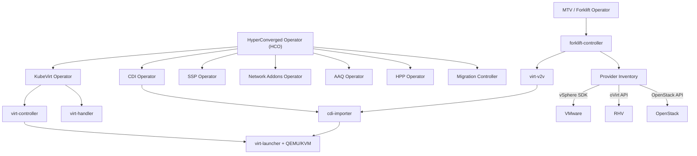

# OpenShift Virtualization Ecosystem Map

How all the pieces fit together: upstream projects, operators, components, and their relationships.

## The Big Picture

## Core Platform: KubeVirt and Friends

These are the projects that make VMs run on Kubernetes.

### [kubevirt/kubevirt](https://github.com/kubevirt/kubevirt)

The core. Extends the Kubernetes API with VM management. Provides:
- CRDs: VirtualMachine, VirtualMachineInstance, VirtualMachineInstanceReplicaSet, VirtualMachinePool, VirtualMachineInstanceMigration
- Components: virt-operator, virt-api, virt-controller, virt-handler, virt-launcher
- Language: Go
- CNCF sandbox project

### [kubevirt/containerized-data-importer](https://github.com/kubevirt/containerized-data-importer) (CDI)

Manages VM disk lifecycle. Imports disk images into PVCs from HTTP, registries, other PVCs, uploads, and hypervisor-specific sources. Provides:
- CRDs: DataVolume, DataSource, DataImportCron
- Components: cdi-operator, cdi-controller, cdi-apiserver, cdi-uploadproxy, cdi-importer
- Language: Go

### [kubevirt/hyperconverged-cluster-operator](https://github.com/kubevirt/hyperconverged-cluster-operator) (HCO)

The "operator of operators." Single entry point for deploying the entire stack. One `HyperConverged` CR creates child CRs for all sub-operators with opinionated defaults.
- CRDs: HyperConverged
- Manages: KubeVirt, CDI, SSP, Cluster Network Addons, HPP, AAQ, Migration Controller
- Language: Go

### [kubevirt/ssp-operator](https://github.com/kubevirt/ssp-operator) (SSP)

Scheduling, Scale, and Performance. Deploys:
- Common VM templates (RHEL, Fedora, CentOS, Windows)
- Default boot sources (auto-downloaded base OS images)
- Template validator webhook
- Tekton pipeline tasks for VM automation
- CRDs: SSP
- Language: Go

### [kubevirt/cluster-network-addons-operator](https://github.com/kubevirt/cluster-network-addons-operator)

Deploys additional networking components:
- Linux bridge CNI plugin
- bridge-marker (labels nodes with available bridges)
- kubemacpool (MAC address management)
- multus-dynamic-networks-controller
- CRDs: NetworkAddonsConfig
- Language: Go

### [kubevirt/hostpath-provisioner](https://github.com/kubevirt/hostpath-provisioner) (HPP)

Local storage provisioner for development/edge environments. Provides a StorageClass backed by node-local paths. What CRC uses for VM disks.
- CRDs: HostPathProvisioner
- Language: Go

### [kubevirt/application-aware-quota](https://github.com/kubevirt/application-aware-quota) (AAQ)

Extends Kubernetes ResourceQuota to be aware of VM workloads. Prevents overcommitting cluster resources with VMs.
- CRDs: AAQ
- Language: Go

### [kubevirt/kubevirt-migration-controller](https://github.com/kubevirt/kubevirt-migration-controller) + [kubevirt-migration-operator](https://github.com/kubevirt/kubevirt-migration-operator)

Newer projects (created October 2025). Handle cross-cluster and decentralized live migration of VMs between OpenShift clusters. This is the underlying mechanism for MTV's cluster-to-cluster live migration feature.
- Language: Go

### [kubevirt/common-instancetypes](https://github.com/kubevirt/common-instancetypes)

Predefined instance types (CPU/memory combinations) and preferences (OS-specific tuning). Analogous to cloud instance types (m5.large, etc.). Ships with OCP Virt via the SSP operator.

### [kubevirt/common-templates](https://github.com/kubevirt/common-templates)

VM templates for various guest operating systems. Being gradually replaced by instance types + preferences but still in use.

## Migration: Forklift / MTV

These are the projects that move VMs from other hypervisors to KubeVirt.

### [kubev2v/forklift](https://github.com/kubev2v/forklift)

The core migration toolkit. An operator + controller that orchestrates VM migrations from VMware vSphere, Red Hat Virtualization, OpenStack, OVA files, Hyper-V, EC2, and other OpenShift Virtualization clusters.

Architecture (see [detailed analysis](../docs/migration-toolkit.md)):
- **Operator layer**: Ansible-based operator deploys the components
- **Controller layer**: Go controllers for Provider, Plan, Migration, NetworkMap, StorageMap, Hook
- **Provider adapter pattern**: Each source hypervisor has an adapter implementing Builder, Client, Validator, DestinationClient interfaces
- **Inventory system**: Per-provider containers that sync VM inventory from source APIs, exposed via REST
- **virt-v2v integration**: Conversion pods that run virt-v2v to install VirtIO drivers and reconfigure guest OS

CRDs: Provider, Plan, Migration, NetworkMap, StorageMap, Hook, ForkliftController

Supported source providers:
| Provider | Cold Migration | Warm Migration | Live Migration |
|----------|---------------|----------------|----------------|
| VMware vSphere (vCenter) | Yes | Yes (CBT) | No |
| VMware vSphere (ESXi) | Yes | Yes (CBT) | No |
| Red Hat Virtualization | Yes | Yes | No |
| OpenStack | Yes | No | No |
| OVA files | Yes | No | No |
| Hyper-V | Yes | No | No |
| EC2 (AWS) | Yes | No | No |
| OpenShift Virtualization | Yes | No | Yes |

### [kubev2v/migration-planner](https://github.com/kubev2v/migration-planner)

Pre-migration assessment tool. Helps inventory and evaluate VMware environments before migration. Discovers VMs, analyzes compatibility, and estimates migration effort.

### [kubev2v/forklift-console-plugin](https://github.com/kubev2v/forklift-console-plugin)

OpenShift console UI plugin for MTV. Adds the Migration section to the OpenShift web console.

### [kubev2v/forklift-must-gather](https://github.com/kubev2v/forklift-must-gather)

Diagnostic data collection for MTV. Used for support and troubleshooting.

## Ansible Integration

### [kubevirt/kubevirt.core](https://github.com/kubevirt/kubevirt.core)

Upstream Ansible collection for KubeVirt. Modules: kubevirt_vm, kubevirt_vm_info, kubevirt_vmi_info, plus a dynamic inventory plugin. Downstream certified as `redhat.openshift_virtualization` on Automation Hub.

### [redhat-cop/openshift_virtualization_migration](https://github.com/redhat-cop/openshift_virtualization_migration)

Validated Ansible collection for migration workflows. 18 roles covering MTV management, migration execution, validation, Day 2 operations. Uses `kubernetes.core.k8s` to programmatically create Forklift CRDs.

### [redhat-cop/openshift_virtualization_ops](https://github.com/redhat-cop/openshift_virtualization_ops)

Day 2 operations collection: backup/restore, hot-plug, lifecycle, networking, patching.

## Networking Components

### [kubevirt/bridge-marker](https://github.com/kubevirt/bridge-marker)

DaemonSet that detects Linux bridges on nodes and labels nodes accordingly. Used by the scheduler to place VMs on nodes with the correct bridge configuration.

### [kubevirt/macvtap-cni](https://github.com/kubevirt/macvtap-cni)

CNI plugin for macvtap networking. Connects VMs directly to the host's physical network interface via macvtap, providing better performance than bridge networking.

### [kubevirt/kubesecondarydns](https://github.com/kubevirt/kubesecondarydns)

DNS for secondary networks. Provides DNS resolution for VMs on Multus secondary networks.

### [kubevirt/ipam-extensions](https://github.com/kubevirt/ipam-extensions)

IP address management extensions for KubeVirt networks.

## Storage Components

### [kubevirt/csi-driver](https://github.com/kubevirt/csi-driver)

CSI driver that exposes KubeVirt VMs' disks as PVs. Used when running Kubernetes inside a KubeVirt VM (nested clusters).

## Upstream to Downstream Mapping

| Upstream Project | Downstream Product | Notes |
|-----------------|-------------------|-------|
| [kubevirt/kubevirt](https://github.com/kubevirt/kubevirt) | OpenShift Virtualization | Core VM runtime |
| [kubevirt/containerized-data-importer](https://github.com/kubevirt/containerized-data-importer) | OpenShift Virtualization | Bundled via HCO |
| [kubevirt/hyperconverged-cluster-operator](https://github.com/kubevirt/hyperconverged-cluster-operator) | OpenShift Virtualization | The install entry point |
| [kubevirt/ssp-operator](https://github.com/kubevirt/ssp-operator) | OpenShift Virtualization | Templates, boot sources |
| [kubevirt/cluster-network-addons-operator](https://github.com/kubevirt/cluster-network-addons-operator) | OpenShift Virtualization | Bundled via HCO |
| [kubevirt/common-instancetypes](https://github.com/kubevirt/common-instancetypes) | OpenShift Virtualization | Deployed by SSP |
| [kubev2v/forklift](https://github.com/kubev2v/forklift) | Migration Toolkit for Virtualization (MTV) | Separate operator |
| [kubevirt/kubevirt.core](https://github.com/kubevirt/kubevirt.core) | redhat.openshift_virtualization | Ansible collection |

## GitHub Organizations

| Org | Purpose |
|-----|---------|
| [kubevirt](https://github.com/kubevirt) | Core KubeVirt project and ecosystem |
| [kubev2v](https://github.com/kubev2v) | Migration tooling (Forklift/MTV) |
| [redhat-cop](https://github.com/redhat-cop) | Community of Practice, validated Ansible collections |

## How They Compose at Runtime

When OpenShift Virtualization is installed and a VM migrated from VMware:

1. **HCO** reconciles the `HyperConverged` CR and creates child CRs
2. **KubeVirt operator** deploys virt-api, virt-controller, virt-handler
3. **CDI operator** deploys the data importer components
4. **SSP operator** deploys templates and boot sources
5. **Network Addons operator** deploys bridge-marker, kubemacpool, etc.
6. **MTV operator** (separate install) deploys forklift-controller, forklift-api, forklift-validation
7. **Forklift Provider controller** connects to vSphere API, syncs VM inventory
8. **Forklift Plan controller** orchestrates the migration pipeline
9. **CDI** handles disk import via VDDK (for vSphere) or provider-specific populator
10. **virt-v2v** converts the disk image (installs VirtIO drivers)
11. **KubeVirt virt-controller** creates the virt-launcher pod for the migrated VM
12. **KubeVirt virt-handler** connects to the launcher via gRPC, starts QEMU/KVM
