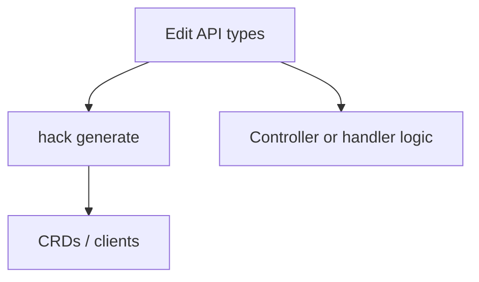
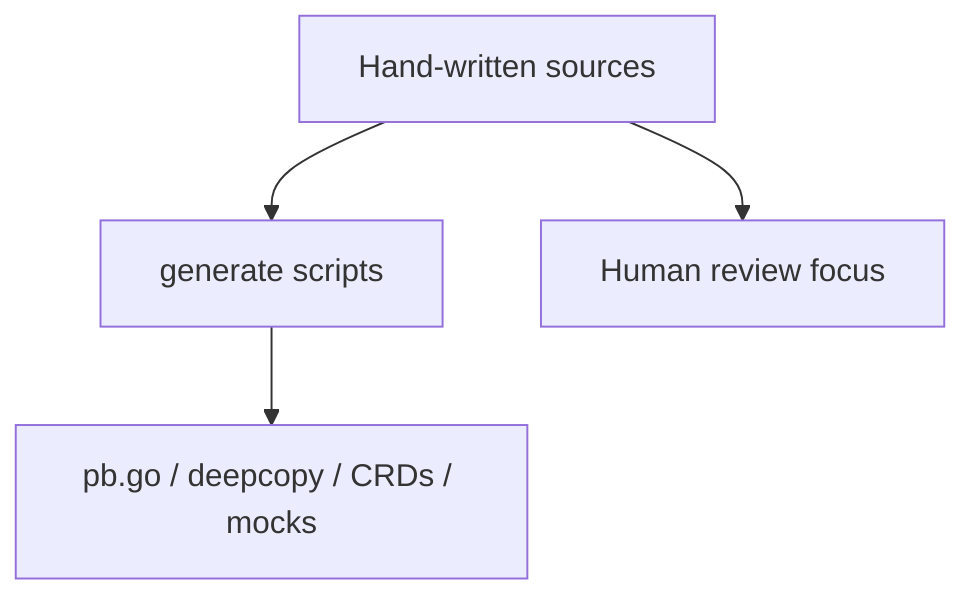
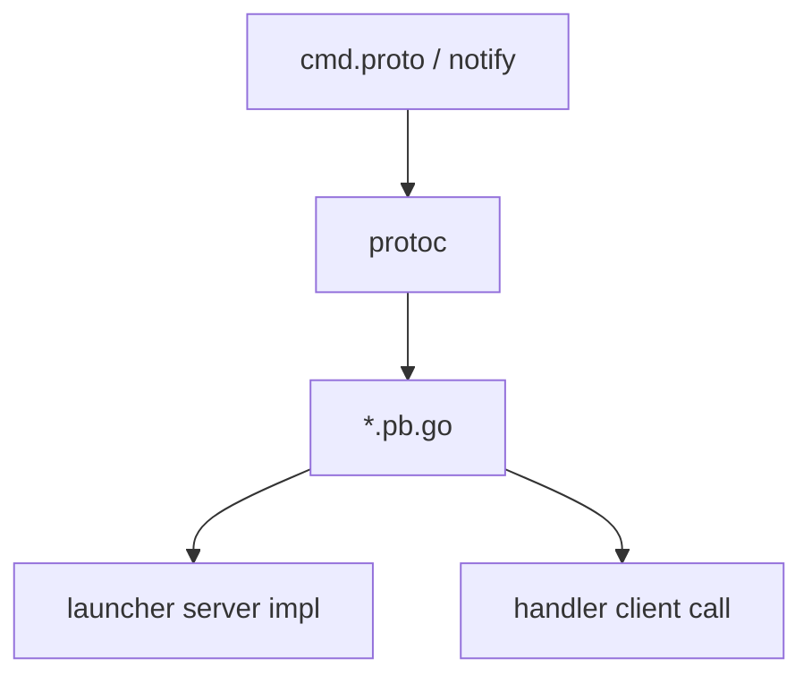
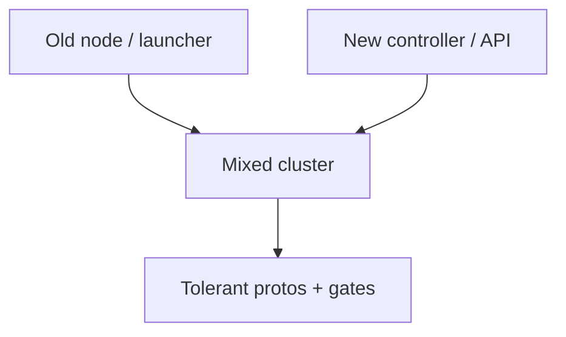
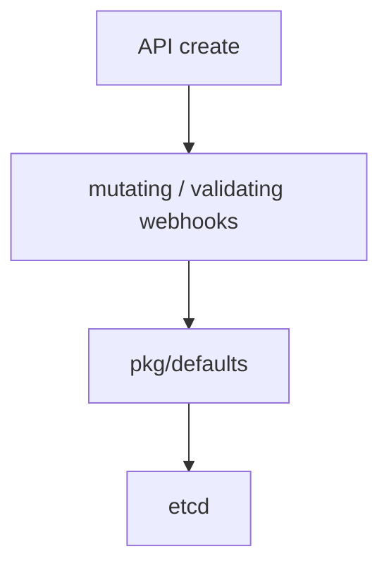

## !intro API, gates, generate

API types, feature gates, and generated code are where many first PRs stumble. Edit inputs; regenerate outputs; hide risky behavior behind gates until it is ready.

## !!steps API changes are special

Adding or changing a field on VM/VMI (or another CRD) means:

1. Update Go types under `staging/src/kubevirt.io/api`
2. Run the project generate targets (deepcopies, CRDs, client stubs as required)
3. Teach controllers/handler/launcher to honor the field
4. Consider validation, defaults, and upgrade compatibility

Do not edit generated deepcopy or CRD YAML as the primary change.



## !!steps Feature gates

New behavior is often hidden behind a **feature gate** until it is stable. Gates live in virt-config / KubeVirt CR configuration (`pkg/virt-config/featuregate`). When you add a gate: define it, check it at the call site, document it, and test both on and off. Deprecation often makes a gate a no-op with a warning.

```go ! gate.go
// Teaching sketch — gate checked at the use site.
if clusterConfig.GuestDeviceMetricsEnabled() {
	// !focus(3:4)
	devices, err := client.GetDevices()
	// collect metrics…
}
```

## !!steps Hand-written vs generated

| Edit by hand | Usually generated |
|--------------|-------------------|
| `*.go` business logic | `zz_generated.*.go` |
| `*.proto` contracts | `*.pb.go` |
| Tests you author | mocks from `mockgen` (via generate) |
| Docs / design notes | CRD YAML from API types |

If a PR is mostly hex churn in `*.pb.go`, that is normal after a `.proto` change — review the `.proto` and call sites, not the blob.



## !!steps Handler ↔ launcher contracts

When the node agent and the launcher must exchange a new operation, the contract is under `pkg/handler-launcher-com` (protobuf). You:

1. Extend the `.proto`
2. Regenerate
3. Implement the server in virt-launcher
4. Call it from virt-handler (or virt-api, depending on the feature)

Keep JSON or libvirt details inside the launcher when possible; keep the RPC payload stable and boring.



## !!steps Update skew awareness

Operators update components in an order that keeps old virt-api from advertising features controllers cannot serve yet; RBAC is often unioned during skew. New RPCs and CRD fields must tolerate mixed versions briefly — especially anything on the migration target path.



## !!steps Config and defaults

Defaults and arch-specific behavior live under `pkg/defaults` and related admitters. A field that is “obvious” on amd64 may need an explicit story on arm64/s390x. Check defaulting/validation webhooks when your API change interacts with those paths.



## !outro Continue

Which tests to write, how libvmi fits, and what a healthy upstream PR looks like.
