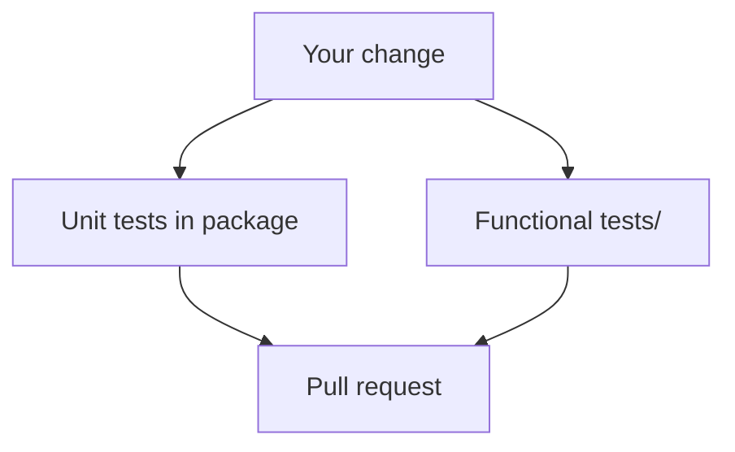
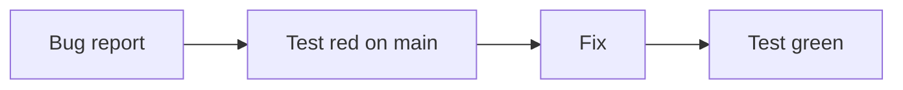
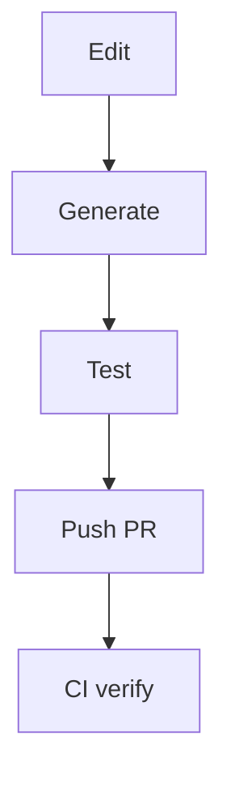
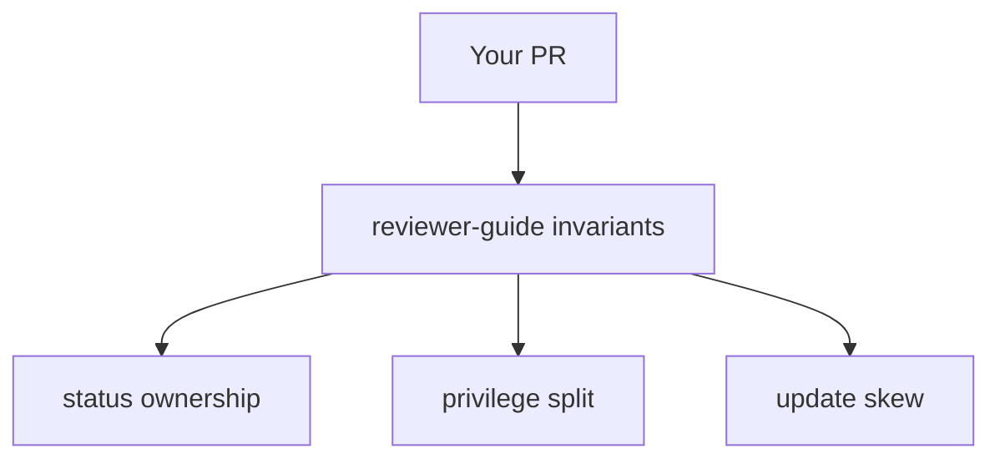
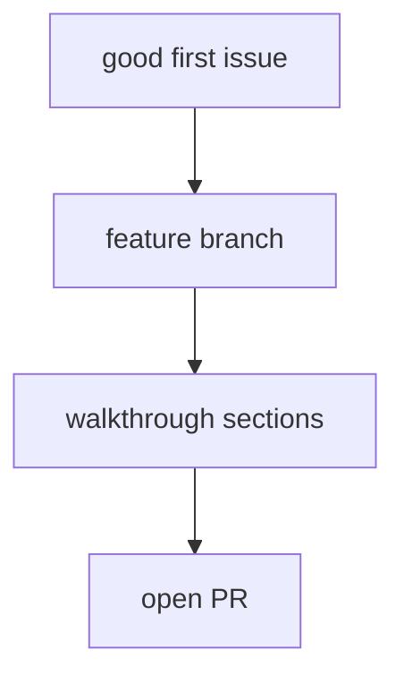

## !intro Tests and PRs

Match the test level to the risk, keep builders dumb, and describe behavior — not only files touched. CI is part of the design.

## !!steps Tests that matter

- **Unit tests** next to the package — parsing, reconcile helpers, metrics labels  
- **Launcher / handler tests** — often need careful fakes for libvirt or cmd clients  
- **Functional tests** under `tests/` — real cluster behavior; slower, higher signal for API-facing changes  

A metrics label change may be unit-only; a new VMI field usually needs functional coverage.



## !!steps libvmi and friends

`pkg/libvmi` (and `libdv`) build test VMIs/DataVolumes with fluent helpers. Keep builders **dumb** — configuration only, no hidden reconcile logic (`pkg/libvmi/README.md`). If your test helper starts “fixing” the API, you are inventing a second controller.

```go ! libvmi.go
// Teaching sketch — builders configure, they do not reconcile.
vmi := libvmi.New(
	libvmi.WithMemoryRequest("1Gi"),
	// !focus(1:1)
	libvmi.WithInterface(libvmi.InterfaceDeviceWithMasqueradeBinding()),
)
```

## !!steps Prove the failure mode

Ideal tests fail without your change and pass with it. For regressions, assert the condition, event, or metric that operators would see — not only an internal function return.



## !!steps A healthy PR

Upstream expectations in short form:

- Small, focused diff; generate in a dedicated commit or clearly separated if huge  
- Tests that fail without your change  
- Release note / gate docs when user-visible  
- Describe *behavior*, not only files touched  

Run generate locally before pushing when you touch APIs or protos.



## !!steps Reviewer-guide hotspots

Expect pushback on: informers in virt-api/handler without strong justification, Update storms on shared status, privileged work shoved into the launcher, and migration/update skew blindness. Read `docs/reviewer-guide.md` once; it will save a round trip.



## !!steps Pick up work

From here: pick a [`good first issue`](https://github.com/kubevirt/kubevirt/issues), read `docs/` in the repo for the subsystem you touch, and ask early on the PR if the layering feels wrong.



## !outro Keep going

You can navigate the tree, follow a VMI from API to QEMU, reason about disks/net/migration, and place a change with the right generate/test expectations. Use outline chapters as a reading list for the deeper lifecycle and platform topics.
