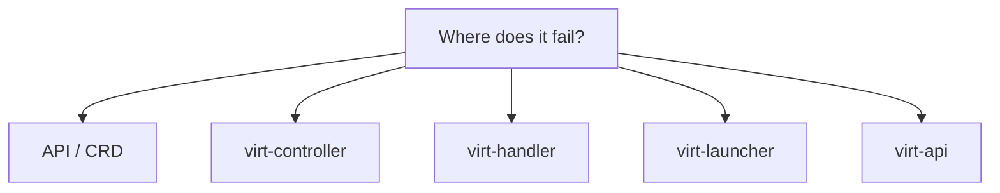
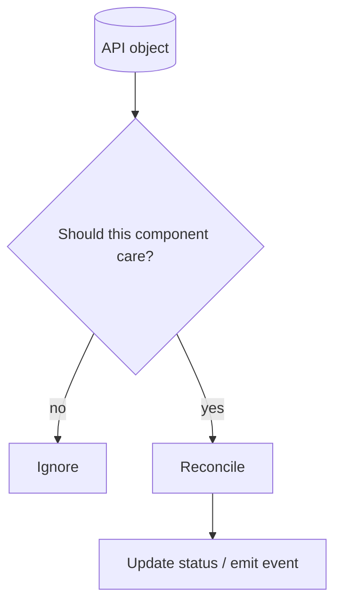
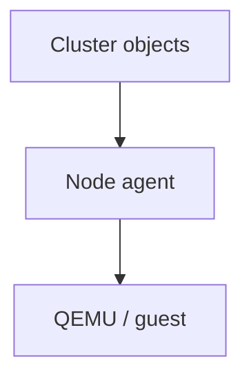
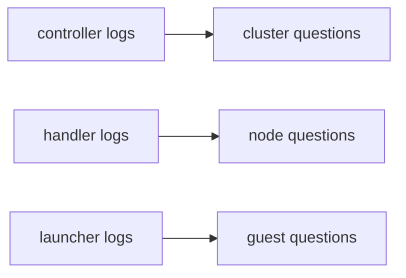
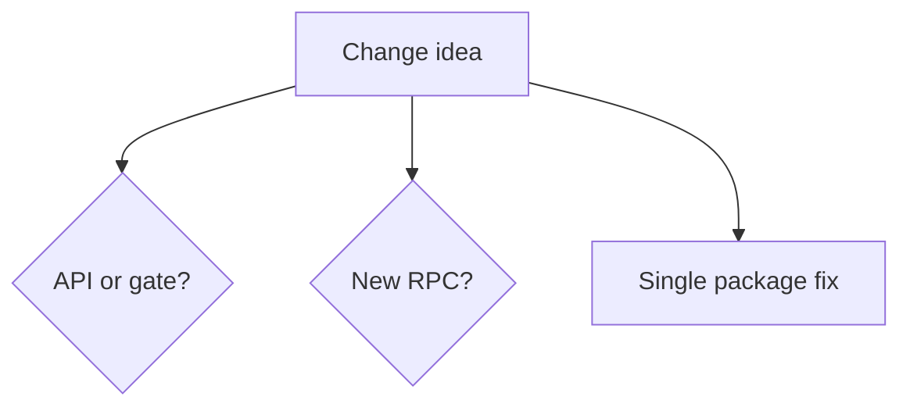
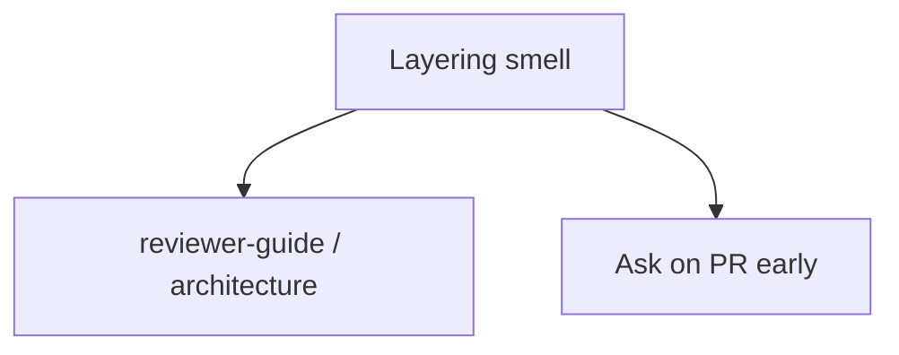

## !intro Triage and layers

You have the map. Start every bug or feature from the **symptom**: which layer should have reacted, and which status field proves it did not.

## !!steps Start from the symptom

| Symptom | Look first |
|---------|------------|
| Wrong / missing API field | `staging/src/kubevirt.io/api`, CRD YAML, validation |
| Pod never created / wrong Pod | `pkg/virt-controller` (+ `services` templates) |
| Domain not defined / node-local failure | `pkg/virt-handler`, launcher logs |
| QEMU / guest agent / virtqemud | `pkg/virt-launcher` |
| Console / VNC / subresource | `pkg/virt-api` |
| Disk materialization | container-disk / storage paths + handler mounts |
| Binding / netns | `pkg/network`, virt-handler |
| Metrics | virt-handler metrics packages |

## !!steps Ask which watcher

KubeVirt is choreography. “Nothing happened” usually means a watcher filtered the object out (`nodeName`, labels, phase) or status never advanced. Read events and `status.conditions` before rewriting logic.

## !!steps Cluster vs node vs guest

- **Cluster** — objects and Pods true?  
- **Node** — handler synced domain? mounts? netns?  
- **Guest** — QEMU running, agent connected, guest OS healthy?

Do not debug QEMU for a Pod that never scheduled.

## !!steps Logs that matter

virt-controller and virt-api are Deployment logs. virt-handler is per-node. virt-launcher is per-VMI Pod — that is where libvirt/QEMU errors show up. Match the log stream to the layer in the table above.

## !!steps Feature or bug shape

New user-visible behavior often needs an API field or gate (next chapter). Pure bugfixes may stay inside one package. If you need handler and launcher both to change, budget for a **Cmd/Notify** proto bump.

## !!steps When to stop and ask

If the fix wants virt-controller to talk to QEMU, or virt-api to run a heavy informer, or generated files edited by hand — pause. Those usually violate layering invariants reviewers will bounce.

## !outro Continue

API changes, feature gates, and what you regenerate versus edit by hand.
