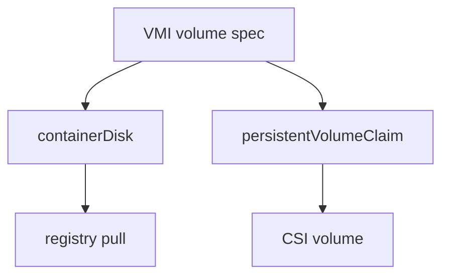
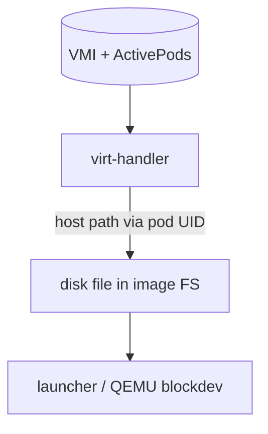
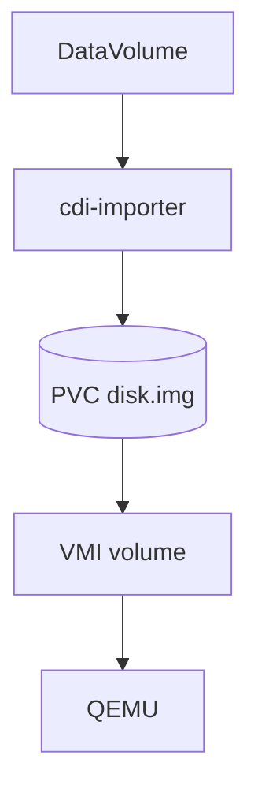
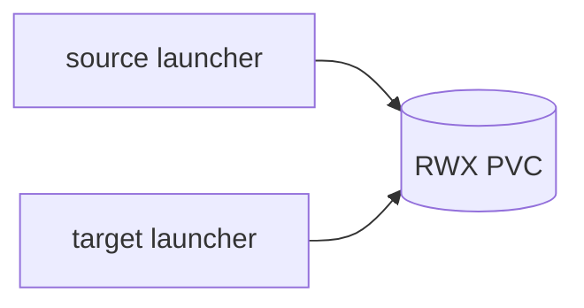
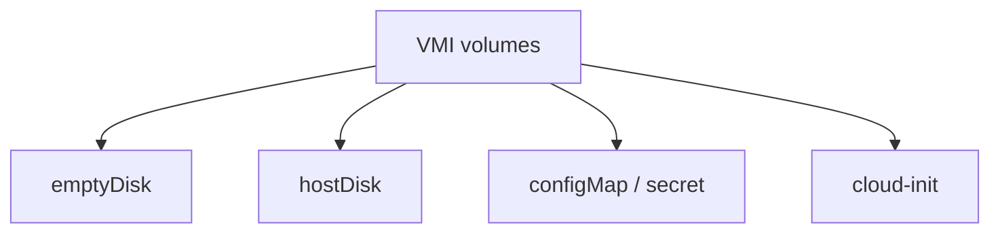

## !intro Disks

KubeVirt does not invent a new storage plane. Disks are Kubernetes volumes (or OCI images reused as disks) that end up as QEMU block devices. Two paths dominate reviews: **containerDisk** and **PVC** (often filled by **CDI**).

## !!steps Two ways to get a disk

| | containerDisk | PVC |
|---|---|---|
| Source | OCI image with a disk file | PersistentVolumeClaim |
| Persist across restart | No (ephemeral overlay) | Yes |
| Sidecar | Yes — keeps image FS alive | No |
| Live migration | Usually block migration of disk | Shared storage if **RWX** |



## !!steps containerDisk: registry as distribution

A containerDisk image is often `FROM scratch` plus `ADD disk.qcow2 /disk/`. The “container” never runs app code — OCI is packaging. virt-controller’s `RenderLaunchManifest` adds init/sidecar containers (`pkg/container-disk`) so kubelet pulls the image before the compute container needs it.


## !!steps Handler mounts; launcher consumes

virt-handler does not watch Pods for this. It watches the **VMI**, finds `ActivePods` UIDs, locates volumes on the node filesystem, and bind-mounts the disk into place for QEMU. Coordination point is the VMI object, not a kubelet handshake.



## !!steps PVC: direct -blockdev

A PVC mounts into the compute container (e.g. `/var/run/kubevirt-private/vmi-disks/<name>/`). QEMU typically opens a single file/`disk.img` (or block device) with `-blockdev` — no sidecar, no qcow backing chain for the common case. Writes persist because the PVC outlives the Pod.

```go ! blockdev.go
// Teaching sketch — PVC path into QEMU.
// filename under vmi-disks/<volume>/disk.img
blockdev := map[string]any{
	"driver":   "file",
	// !focus(5:6)
	"filename": "/var/run/kubevirt-private/vmi-disks/rootdisk/disk.img",
	"read-only": false,
}
```

## !!steps CDI fills PVCs

**Containerized Data Importer** is a sibling project. DataVolumes create/populate PVCs from HTTP, registry, clone, upload, blank, … KubeVirt consumes the PVC; CDI owns import/convert (often to raw on filesystem PVCs). Without CDI you can still attach a hand-made PVC — you just own population yourself.



## !!steps RWX and migration

Live migration with shared disks needs **ReadWriteMany** so source and target launchers see the same PVC at once. RWO is fine for non-migratable VMs. containerDisks generally migrate by copying disk state (block migration), which is a different cost model.



## !!steps Other volume types (map)

You will also see emptyDisk, hostDisk, configMap/secret disks, cloud-init ISOs, virtiofs. Same pattern: controller templates mounts, handler/launcher turn them into domain devices. When triage-ing, ask “who materializes the bytes?” before “why is QEMU sad?”



## !outro Continue

How the guest NIC attaches to the Pod network — and which bindings survive live migration. (CDI as a full project returns in the Ecosystem section.)
