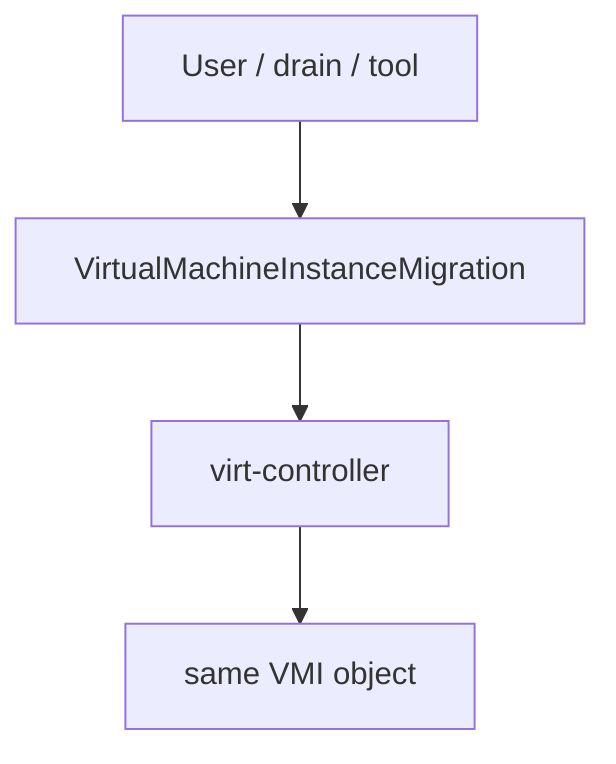
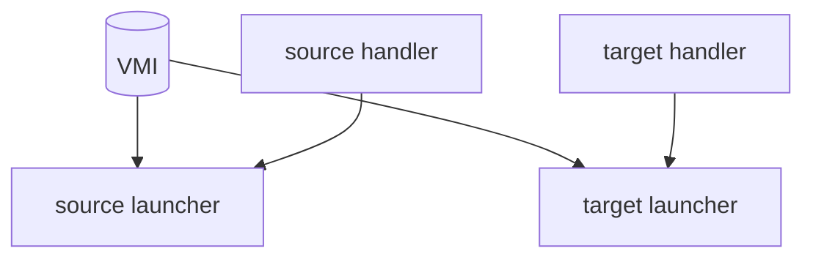
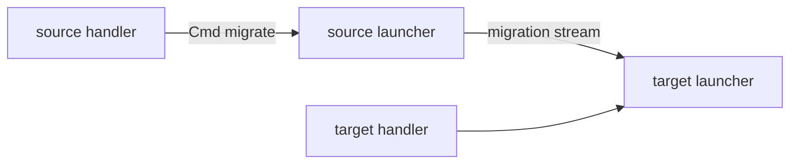
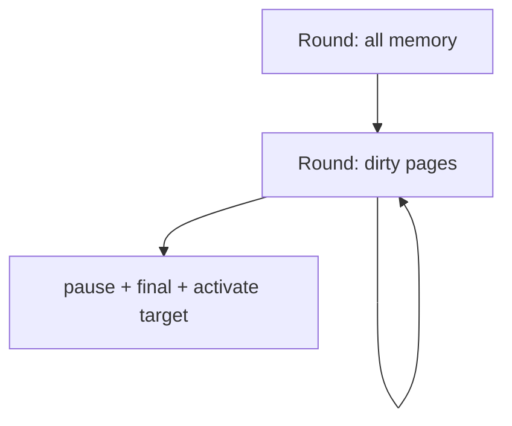
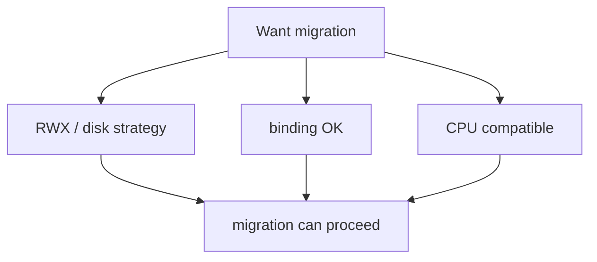
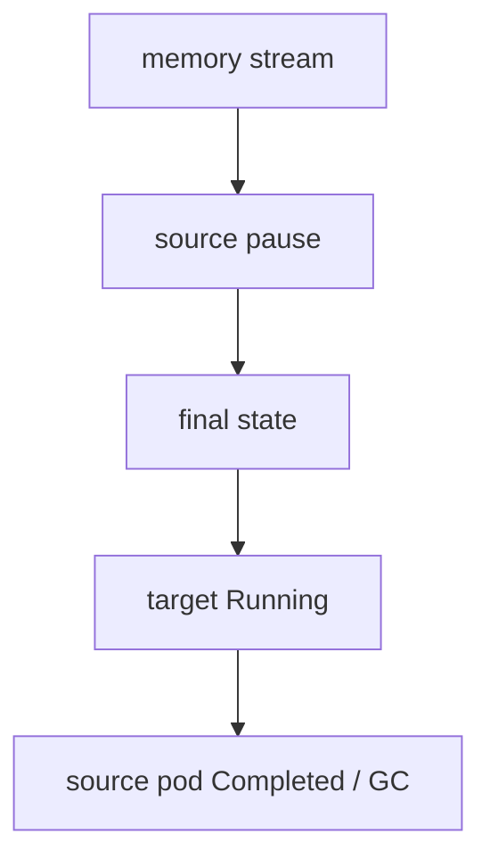
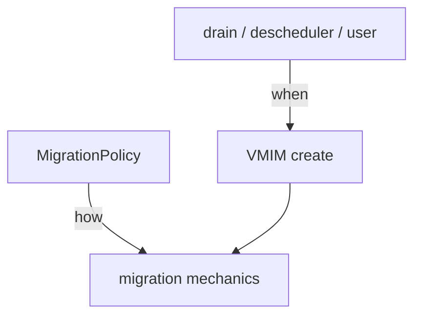

## !intro Live migration

Live migration moves a running domain from one node’s launcher to another with minimal guest downtime. Controllers set intent; handlers and launchers move memory and device state. KubeVirt does **not** give you VMware DRS — policies shape *how*, not autonomous *when*.

## !!steps Entry: VirtualMachineInstanceMigration

A `VirtualMachineInstanceMigration` (VMIM) is created by a user, drain/evacuation, or external tooling. virt-controller watches it and drives the workflow. The VMI UID stays stable; Pods come and go.

## !!steps Dual ActivePods

Controller creates a **target** virt-launcher Pod; scheduler places it. Until cutover, the VMI tracks more than one pod in `status.ActivePods` (source + target). Handlers on both nodes participate — source sends, target receives.

## !!steps Source and target handlers

Source virt-handler asks its launcher to migrate via libvirt/QEMU migration APIs. Target launcher/virtqemud is primed to accept. Migration proxy/TLS and ports (commonly in the 49152+ range inside the pod) carry the stream. Premigration hooks can fix target-side domain XML for upgrade skew.

## !!steps Pre-copy convergence

Default is **pre-copy**: iteratively ship dirty pages while the guest runs, then a short pause for final state. If dirty rate beats transfer rate, migration never converges — then auto-converge, post-copy, or workload-disruption knobs (often via **MigrationPolicy**) enter the chat.

## !!steps Hard gates

Migration fails closed without:

- **RWX** (or another shared/block-migration strategy) for persistent disks  
- A **migratable binding** (not pod-network bridge)  
- **CPU model** compatibility (baseline models help)  
- Healthy handlers on both nodes and open migration ports  

## !!steps Cutover and cleanup

On switchover, source pauses, leftover state ships, target resumes, network announces (e.g. GARP). Source launcher completes and is GC’d; VMI status records migration timestamps. Abort paths exist when progress timeouts fire.

## !!steps MigrationPolicy vs DRS

`MigrationPolicy` selects bandwidth, timeouts, auto-converge/post-copy, dedicated migration networks — applied by label selectors. It does **not** continuously rebalance load like DRS. Evacuation/descheduler/tools decide *when*; understand that split in design reviews.

## !outro Continue

VM RunStrategy, virt-api admission/subresources, and who may write status.
