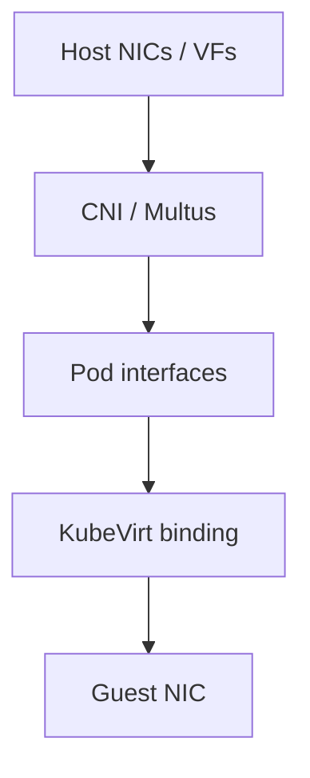
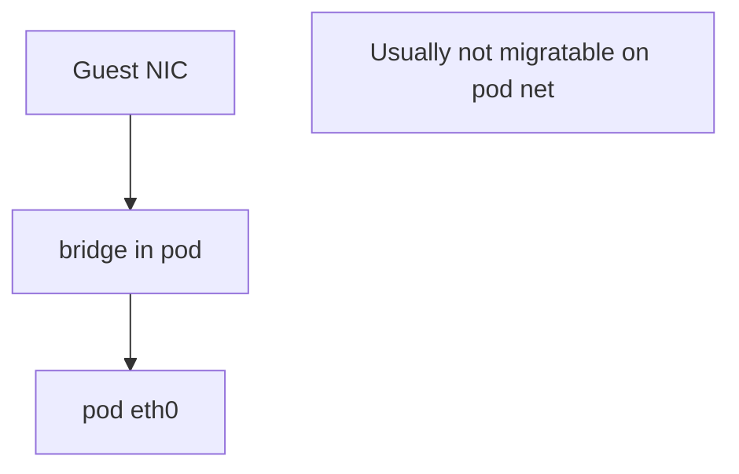
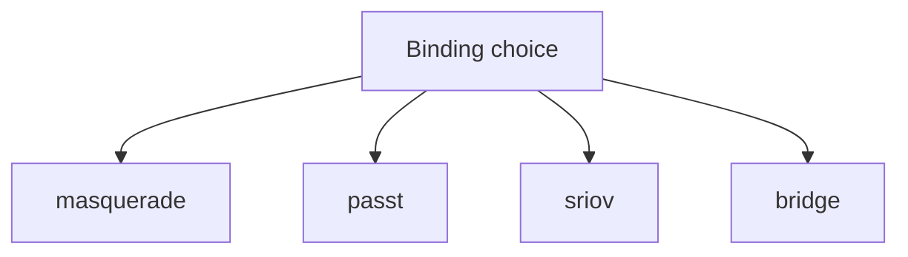
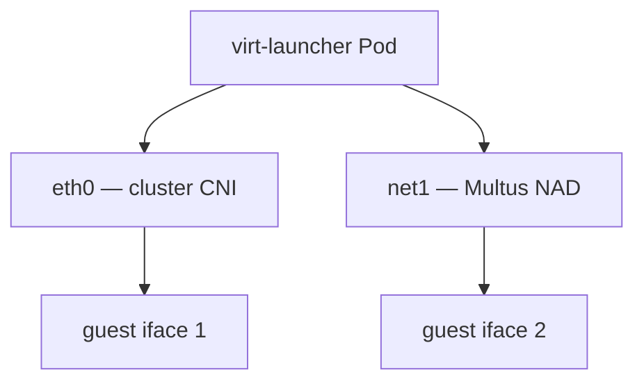
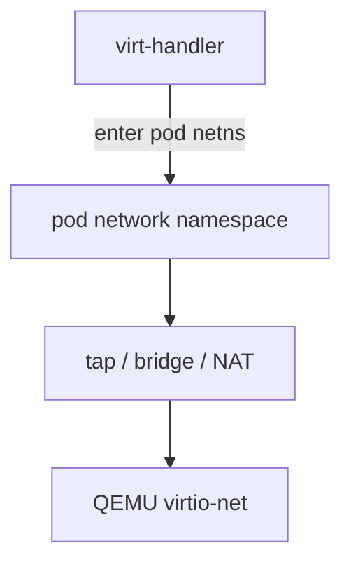

## !intro Networking

Networking has three altitudes: host links, CNI pod interfaces, and **KubeVirt bindings** that connect the guest NIC to the Pod’s network. Maintainers spend most time on the third.

## !!steps Three layers

1. **Host** — physical NICs, bridges, SR-IOV VFs  
2. **Pod** — cluster CNI gives the virt-launcher Pod its `eth0` (and Multus extras)  
3. **Binding** — KubeVirt wiring inside the Pod (and sometimes netns surgery from the handler)



## !!steps Masquerade (default mental model)

Masquerade gives the guest an internal IP (often `10.0.2.2`) NAT’d behind the Pod IP. Outbound SNAT; inbound via Pod IP / Services. **Live migration friendly** — guest IP stays stable while Pod IP may change. NetworkPolicies apply like a normal Pod.


## !!steps Bridge binding

Bridge puts the guest on the Pod interface more directly — guest often sees the Pod IP/MAC story differently. **Pod-network bridge is not live-migration safe** in the usual setup: the IP/MAC identity does not move cleanly with the Pod. Prefer masquerade/passt/SR-IOV when migration matters.



## !!steps Passt and SR-IOV

**Passt** — userspace networking with NAT-ish properties; migratable option alongside masquerade.  
**SR-IOV** — VFIO passthrough of a VF into the guest; high performance, Multus NAD + device plugin plumbing; migration supported with the right setup. Hotplug rules differ by binding.



## !!steps Multus secondary networks

Cluster CNI is one interface. Multus adds **NetworkAttachmentDefinition**-driven extras (Linux bridge, SR-IOV, …). A VM can keep masquerade on the pod network and attach L2/VF networks for data planes. Node labeling (e.g. bridge-marker) keeps Pods off nodes that lack the bridge/VF.



## !!steps Handler netns work

Bindings are not “set and forget YAML.” virt-handler (and helpers under `pkg/network`) manipulate the Pod network namespace — bridges, taps, dummy devices, iptables/nft for masquerade — so traffic reaches QEMU’s virtio-net. When networking breaks after a VMI is Running, read handler logs and netns state, not only the CNI plugin.



## !!steps Binding ↔ migratability

Before promising live migration, check:

- Pod-network **bridge** → usually no  
- **Masquerade / passt / SR-IOV** → yes (with other gates)  
- Secondary L2 networks → case-by-case (MAC, VF move, …)

MigrationPolicy and cluster config tune *how*; they do not invent DRS-style *when*.

```go ! migrate-gate.go
// Teaching sketch — gates reviewers think about.
type MigrationGates struct {
	// !focus(1:3)
	StorageRWX     bool
	BindingOK      bool // masquerade|passt|sriov …
	CPUCompatible  bool
}
```

## !outro Continue

Live migration as a distributed state machine: VMIM, dual pods, and convergence.
