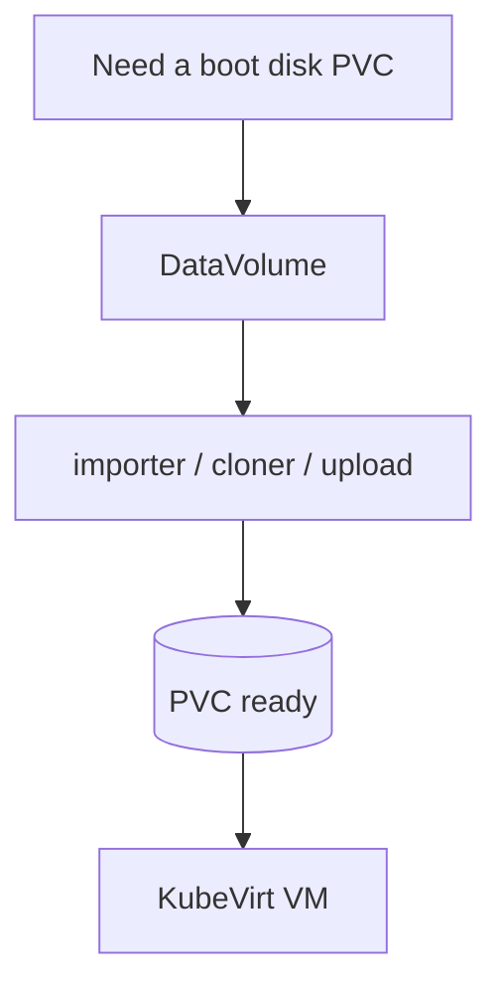
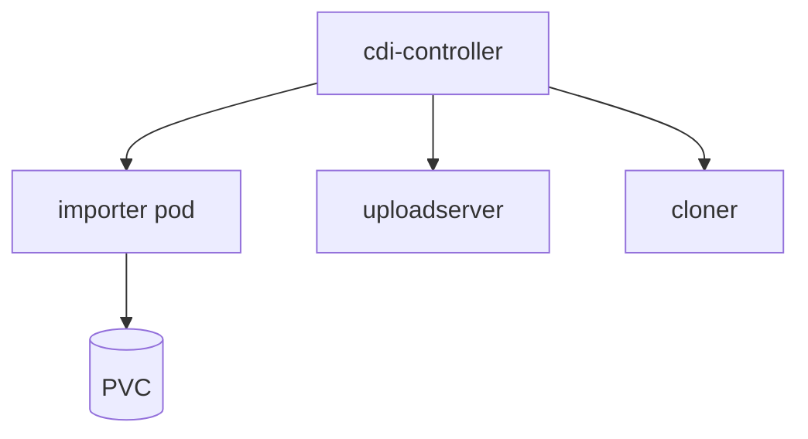
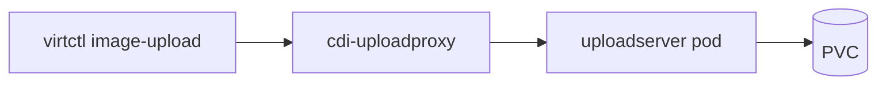
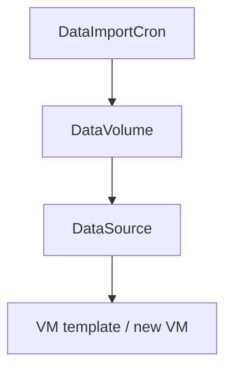
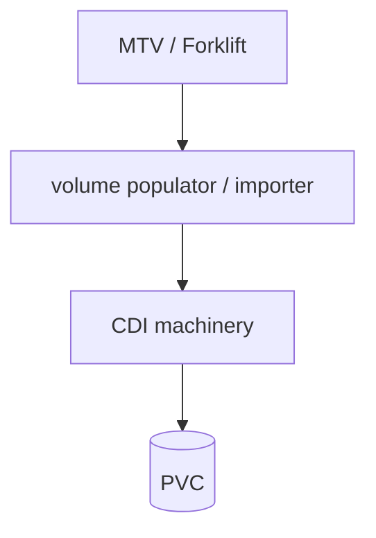

## !intro CDI

**Containerized Data Importer** (`kubevirt/containerized-data-importer`) populates PersistentVolumeClaims with disk images. KubeVirt consumes the PVC; CDI owns import, upload, clone, and related CRDs. Repo boundary is real — different operators, different controllers.

## !!steps Why CDI exists

Without CDI you can still run VMs (containerDisk, emptyDisk, hand-made PVCs). You cannot declare “give me a PVC with this qcow from that URL” as one object, or upload/clone golden images cleanly. CDI adds that lifecycle.



## !!steps DataVolume

A **DataVolume** names a source (HTTP, registry, PVC clone, upload, blank, snapshot, …) and storage request. CDI creates/binds the PVC, runs a worker pod, converts (often to raw on filesystem PVCs), and marks success. VMs often embed `dataVolumeTemplates` so create-VM implies create-DV.

```go ! dv.go
// Teaching sketch — one CR, population included.
type DataVolumeSpec struct {
	// !focus(1:2)
	Source  DataVolumeSource // http, registry, pvc, upload, …
	Storage *StorageSpec
}
```

## !!steps Long-running vs transient pods

| Always on | Per job |
|-----------|---------|
| cdi-operator | cdi-importer |
| cdi-controller | cdi-cloner |
| cdi-apiserver | cdi-uploadserver |
| cdi-uploadproxy | ovirt/openstack populators (Forklift) |

Debug imports in the **transient** pod logs, not only the controller.



## !!steps Upload and clone

`virtctl image-upload` hits **cdi-uploadproxy**, which forwards to an uploadserver attached to the target PVC. Clones prefer efficient CSI/snapshot paths when StorageProfile allows, else pod-to-pod copy. StorageProfile per StorageClass is where accessMode/volumeMode/clone strategy live.



## !!steps Golden images

**DataImportCron** + **DataSource** refresh shared images on a schedule. Product templates (SSP) often point at those sources. Stale or failed crons look like “new VM has old OS” — check CDI, not virt-launcher.



## !!steps Populatores and MTV

Forklift/MTV can use CDI **volume populators** (oVirt, OpenStack, VDDK-shaped paths) so migration disks land as PVCs without reinventing CSI. When a Plan fails mid-copy, the worker may be a CDI populator/importer under MTV’s orchestration.



## !!steps Handoff back to KubeVirt

VMI phase stays pending until DV succeeds when using dataVolumeTemplates. After `Succeeded`, the Disks chapter applies: PVC mount, `-blockdev`, RWX for live migrate. CDI bugs stop at “PVC not Ready”; KubeVirt bugs start at “PVC Ready, domain unhappy.”


## !outro Continue

MTV: providers, maps, and Plans — the import control plane above CDI.
