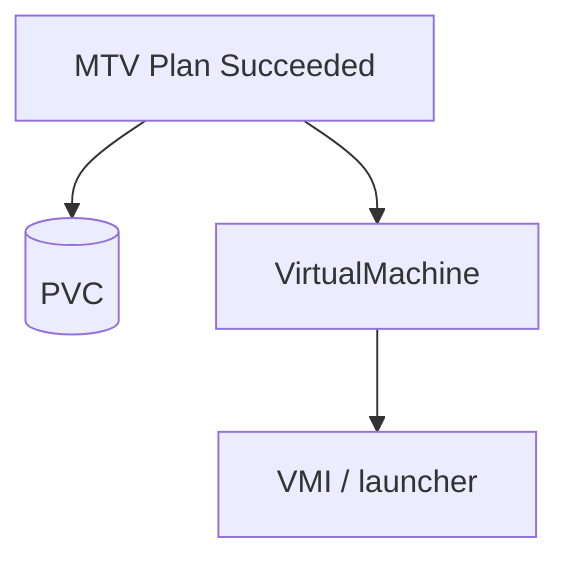
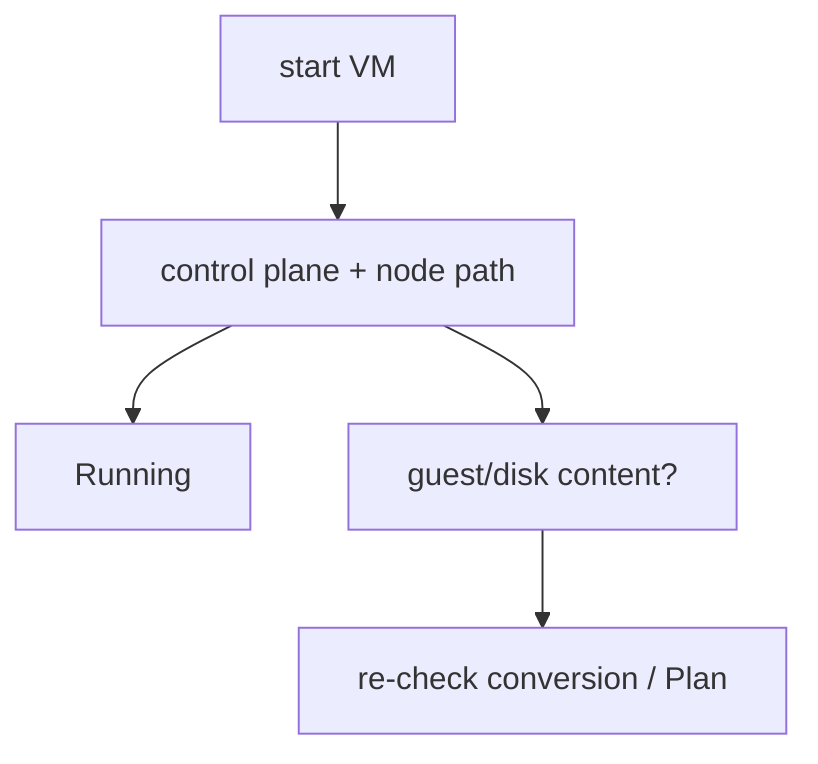
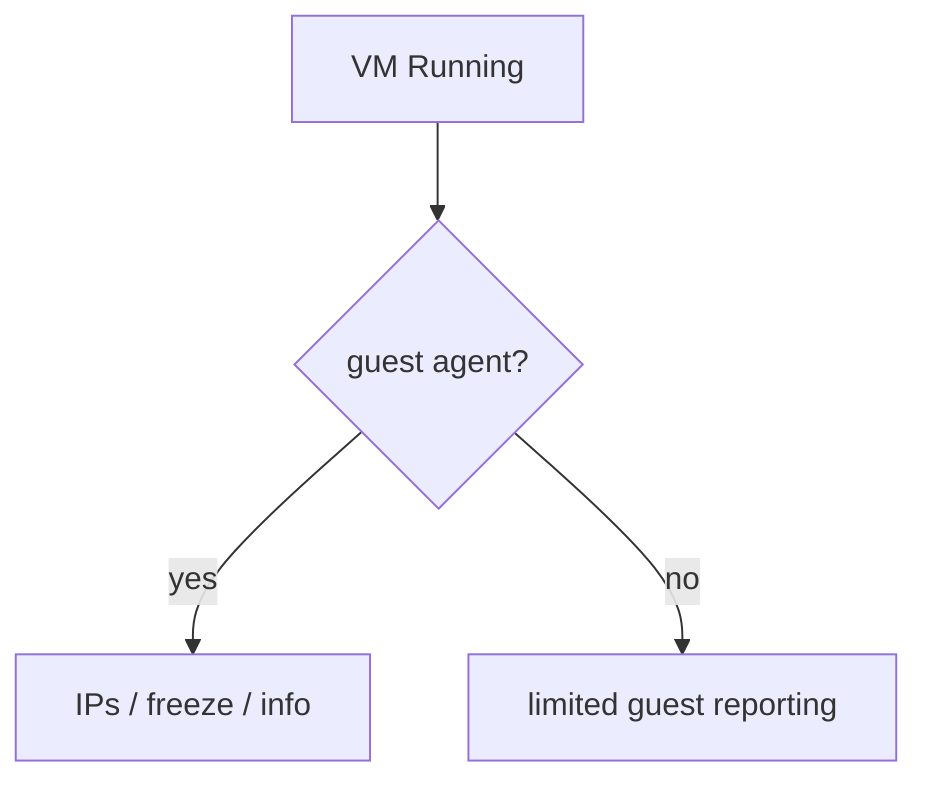
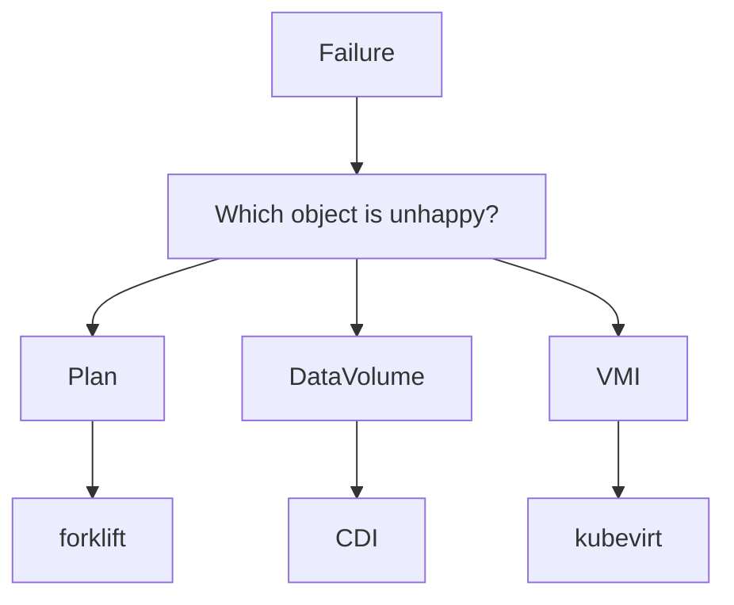
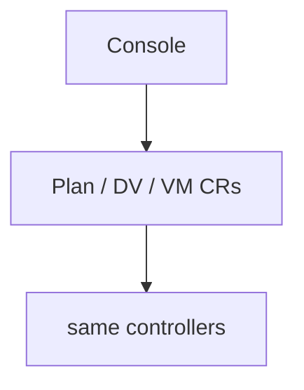
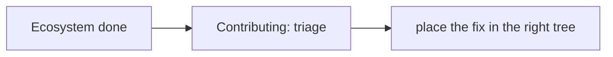

## !intro Hand-off to KubeVirt

MTV’s success condition is roughly: **converted disk on a PVC + a VirtualMachine CR that can start**. From there the core curriculum applies — RunStrategy, virt-controller Pod, handler, domain. Knowing where the baton passes saves days of wrong-repo debugging.

## !!steps What MTV leaves behind

Typical residue:

- Populated **PVC**(s) (via CDI/populator)  
- A **VirtualMachine** (and soon a VMI if Always/started)  
- Network interfaces shaped by **NetworkMap**  
- Guest hopefully with VirtIO and working boot  

MTV does not keep owning the domain afterward.



## !!steps First boot is KubeVirt’s job

If the VM fails to schedule, attach, or reach Running, debug like any other VM: Pod events, virt-handler, launcher logs, binding, storage accessMode. Only loop back to MTV if the disk content or guest conversion is wrong (no VirtIO, wrong OS config).



## !!steps Guest agent and Day-2

Cold conversions sometimes skip **qemu-guest-agent** when package installs are impossible. Symptoms: missing guest IPs in status, weaker freeze/snapshot. That can be an import/guest-tools gap, not a metrics bug in virt-handler.



## !!steps Triage table

| Failure mode | First repo |
|--------------|------------|
| Inventory / provider connect | MTV (Forklift) |
| Plan / map validation | MTV |
| PVC not populated | CDI (+ MTV worker) |
| virt-v2v / conversion | MTV (+ virt-v2v/libguestfs) |
| VMI Pending / Failed scheduling | KubeVirt |
| Domain / launcher crash | KubeVirt |
| Live migrate between nodes | KubeVirt (not MTV) |



## !!steps Status to read

Always gather: Plan name/phase/conditions, DV/PVC phase, VM/VMI phase/conditions, migration or importer pod name. “VM is broken” without those four is not a bug report.

```go ! evidence.go
// Teaching sketch — evidence pack for import bugs.
type ImportEvidence struct {
	// !focus(1:4)
	PlanPhase  string
	DVPhase    string
	VMIPhase   string
	WorkerPod  string
}
```

## !!steps Product wrappers

OpenShift Virtualization UI may create Plans and show progress. The control plane underneath is still Forklift CRs + CDI + KubeVirt. Reproduce with CRs/`virtctl` when you need to know which layer regressed.



## !!steps Back to contributing

Core Contributing chapters still describe `kubevirt/kubevirt` PR craft. For CDI/MTV, learn each repo’s test and OWNERS layout — but the **layering instinct** (which watcher, which object) transfers.



## !outro Continue

Contributing: triage by layer in the KubeVirt core, then API/gates/generate and tests.
