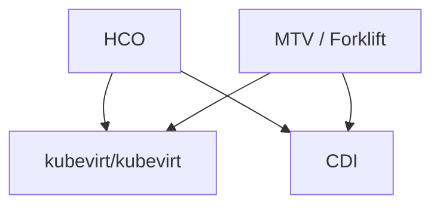
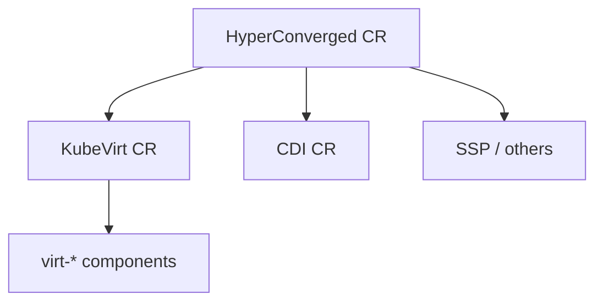
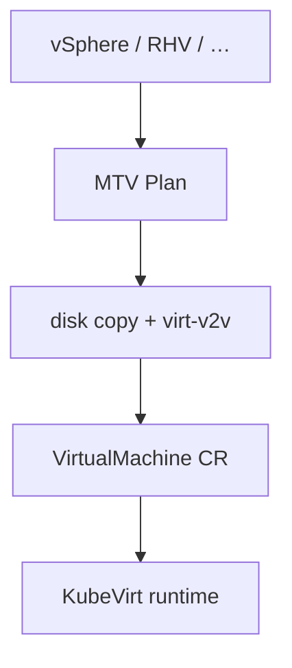
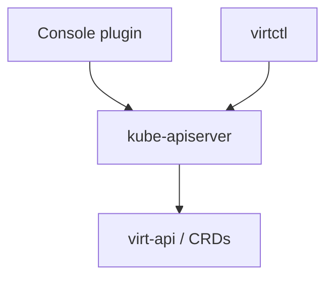
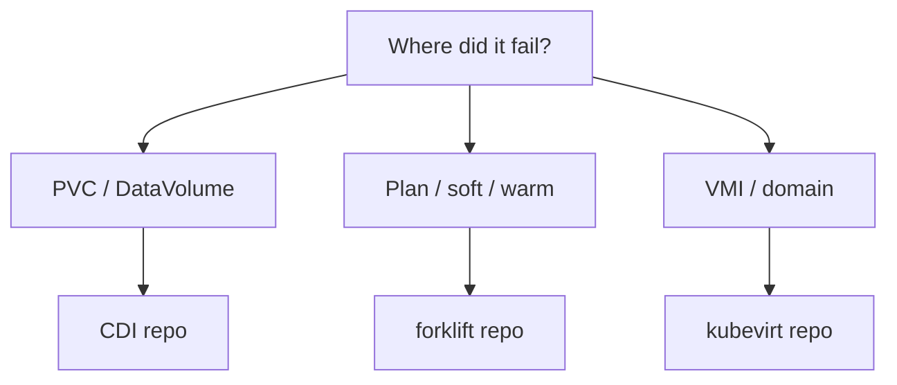

## !intro Ecosystem map

KubeVirt runs VMs. It does not import disks from vSphere, ship a full product UI, or alone manage golden-image pipelines. Those jobs live in **sibling repos**. This section is multi-project on purpose — always ask *which git tree owns the bug*.

## !!steps Core vs siblings

**Core** — `kubevirt/kubevirt`: CRDs, virt-controller/handler/api/launcher, live migration of *already running* guests.

**Siblings** you will hit constantly:

| Project | Repo | Job |
|---------|------|-----|
| CDI | `kubevirt/containerized-data-importer` | Fill/clone/upload PVCs |
| HCO | `kubevirt/hyperconverged-cluster-operator` | Operator-of-operators packaging |
| MTV | `kubev2v/forklift` | Import VMs from foreign hypervisors |
| SSP / CNAO / … | various | Templates, extra networking, … |

## !!steps HCO packages, it does not replace

HyperConverged (and OpenShift Virtualization’s product install) create child CRs for KubeVirt, CDI, SSP, network addons, etc. Day-2 “the product” bugs may be HCO defaults, not virt-handler. Upstream core PRs still land in `kubevirt/kubevirt`.

## !!steps CDI owns disk population

KubeVirt mounts PVCs and boots them. **Getting bytes into the PVC** — HTTP, registry, upload, clone, many migration backends — is CDI (next chapter). MTV and virtctl image-upload both lean on that plane.

## !!steps MTV owns import from elsewhere

MTV inventories vSphere/RHV/OpenStack/OVA (and more), maps networks/storage, copies disks, runs guest conversion, then creates **VirtualMachine** CRs. After that, KubeVirt’s RunStrategy and node path take over. MTV is not KubeVirt live migration.

## !!steps Console and clients

OpenShift console plugins and `virtctl` are clients of the same APIs. Plugin bugs are often UI/backend aggregation; subresource bugs still land in virt-api. Prefer tracing **API + CR status** before blaming the sidebar.

## !!steps One triage question

Before digging: **Did a PVC fail to populate, did a Plan fail to convert, or did a VMI fail to run?** Those three answers send you to CDI, MTV, or KubeVirt respectively — sometimes two, rarely all three for the same root cause.

## !!steps Reading order

Finish enough core (Foundations → Data plane at least) so VM/VMI/PVC/live-migration mean something. Then this section. Contributing at the end still focuses on `kubevirt/kubevirt` PR mechanics; CDI/MTV have their own CI and OWNERS.

## !outro Continue

CDI in depth: DataVolumes, importer pods, and why KubeVirt alone cannot manage disk lifecycle.
