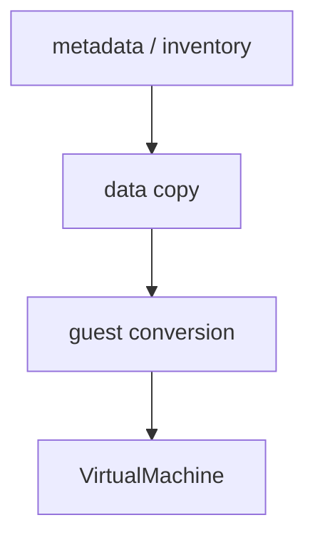
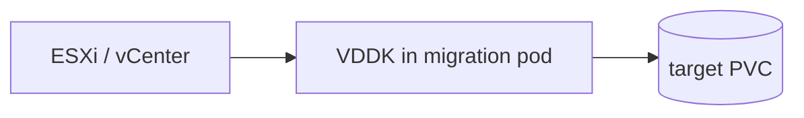
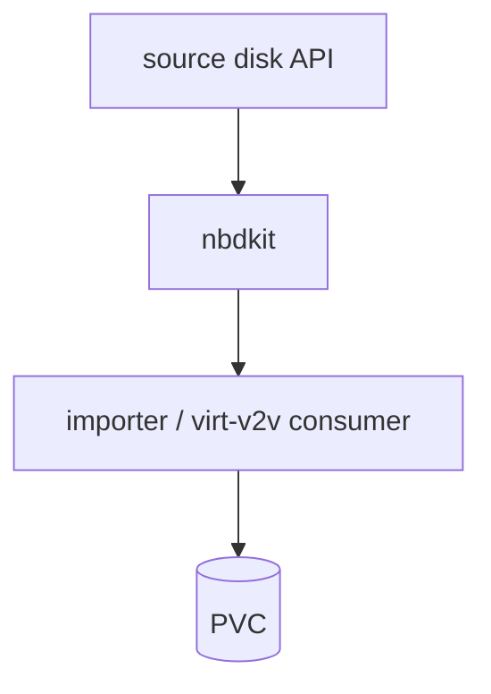
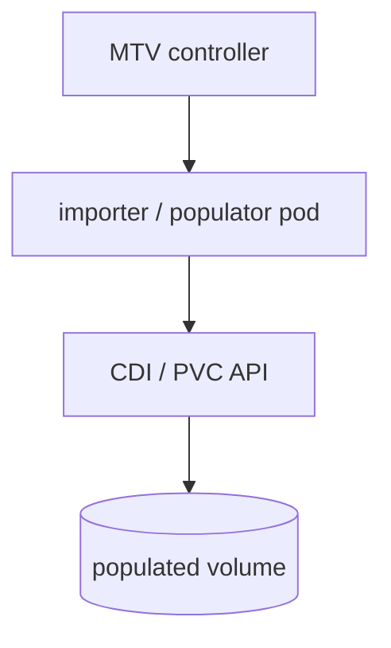
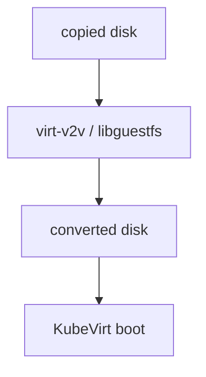
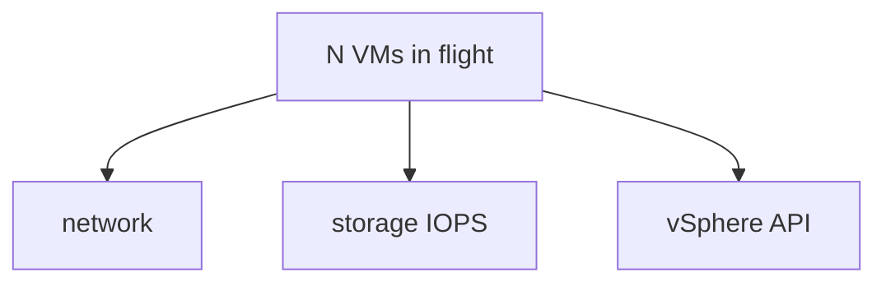

## !intro MTV data path

Import is a pipeline: read blocks from the source, land them on target storage (usually via CDI), then **convert** the guest disk so VirtIO and KubeVirt boot paths work. Different sources light up different workers.

## !!steps Three concerns

1. **Metadata** — inventory → OpenShift/KubeVirt object shape (networks, disks, CPU)  
2. **Data copy** — bytes from datastore/LUN/API to PVC  
3. **Guest conversion** — virt-v2v / libguestfs injects drivers, fixes boot  

Failures cluster on one of these — do not debug virtqemud for a VDDK read error.



## !!steps VMware and VDDK

For vSphere, **VDDK** is effectively required in real deployments (especially vSAN). You build a VDDK container image from Broadcom/VMware bits and point MTV at it. Missing or wrong VDDK looks like mysterious importer failures, not KubeVirt admission errors.



## !!steps nbdkit and block access

Copy stacks often use **nbdkit** (and related plugins) to expose remote disks as NBD for consumers. Credentials and transport stay in that layer — useful when reading labs on “how blocks move without reinventing SCSI in Go.”



## !!steps CDI as the landing zone

Bytes usually become a PVC through CDI importer or **volume populators** (oVirt, OpenStack, …). MTV orchestrates; CDI (or populator) writes `disk.img` / block volume. Watch DataVolume/PVC status alongside Plan conditions.



## !!steps virt-v2v conversion

After (or as part of) copy, a conversion pod runs **virt-v2v**: install/configure VirtIO drivers, strip VMware-isms, prepare boot for QEMU/KVM. Guest OS support matrices differ for cold vs warm. Conversion failure ⇒ PVC may exist but VM will not boot cleanly.



## !!steps Resource and scale limits

Concurrent Plans hammer network, storage IOPS, and source API rate limits. Tune inflight VMs; ESXi NFC memory matters above ~10 concurrent from one host. Quotas that look fine for steady-state VMs fail mid-migration.



## !!steps Storage offload (awareness)

Some paths migrate LUNs/offload instead of streaming every block through a pod — different tradeoffs (lab territory). Know it exists so “why is this Plan not using VDDK?” has an answer beyond “bug.”

```go ! path.go
// Teaching sketch — pick a copy strategy per source/storage.
type CopyStrategy string
const (
	// !focus(1:3)
	StrategyVDDK    CopyStrategy = "vddk"
	StrategyPopulator CopyStrategy = "populator"
	StrategyOffload CopyStrategy = "offload"
)
```

## !outro Continue

Warm vs cold: downtime, CBT, cutover — and the live-migration confusion.
