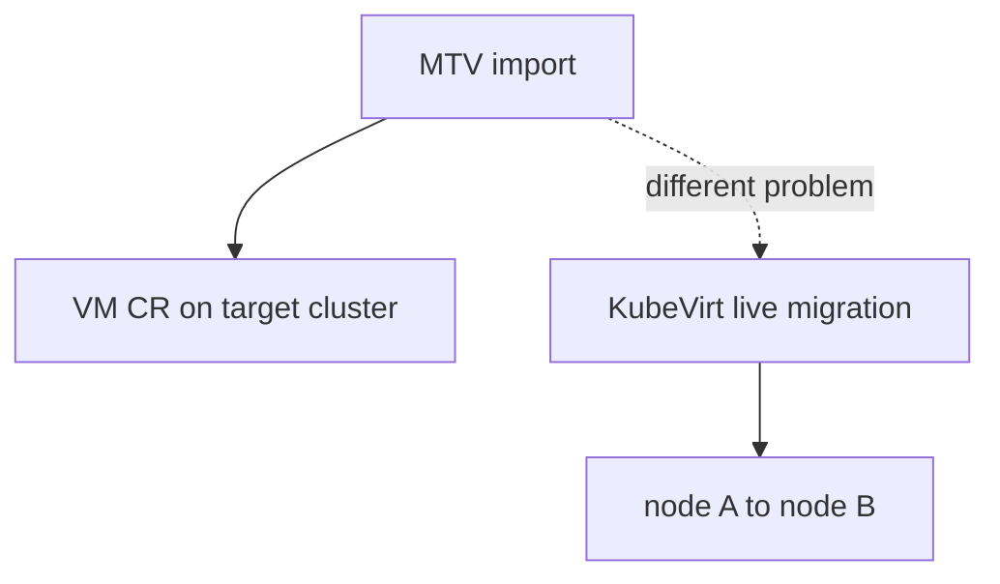
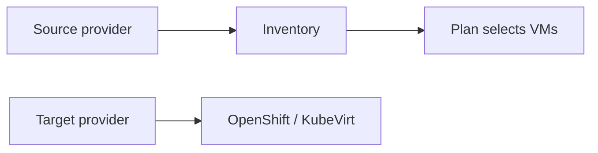
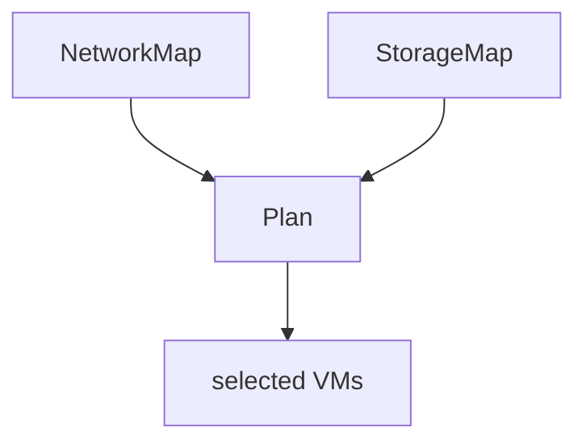
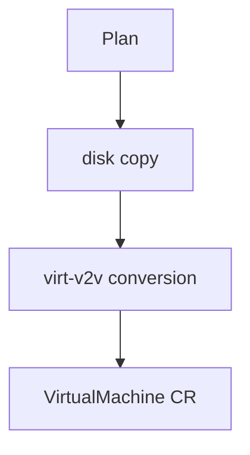
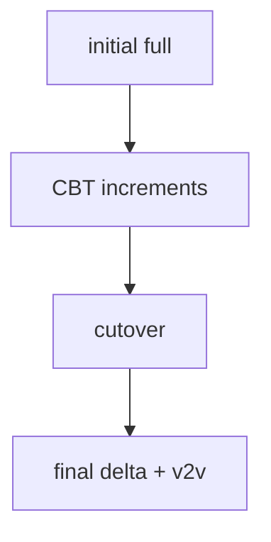
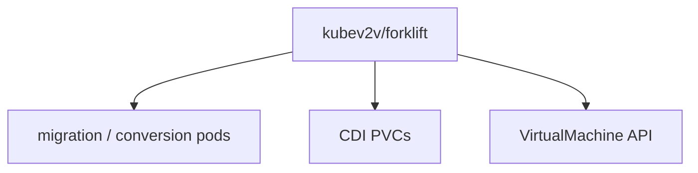

## !intro MTV overview

**Migration Toolkit for Virtualization** (upstream **Forklift**, `kubev2v/forklift`) bulk-imports VMs from foreign hypervisors into a KubeVirt-based cluster. It produces inventory, copies disks, converts guests, and creates **VirtualMachine** objects — then KubeVirt runs them.

## !!steps What MTV is not

Not KubeVirt **live migration** (move a running domain between nodes). Not a general backup product. It is **import/migration from elsewhere**: vSphere, RHV/oVirt, OpenStack, OVA, and related sources, typically into OpenShift Virtualization.

## !!steps Providers

Register a **source** provider (e.g. vCenter URL, creds, CA) and a **target** (the destination cluster). MTV uses the source API to inventory VMs, networks, and datastores. Broken TLS or inventory permissions fail before any disk copy.

## !!steps NetworkMap and StorageMap

Reusable mappings: vSphere port groups → NADs / networks; datastores → StorageClasses. Plans reference maps so you do not re-encode topology per VM. Wrong maps produce “migrated but unreachable” or pending PVCs — often config, not virt-handler.

## !!steps Plan CR

A **Plan** picks VMs, attaches maps, and chooses **cold** or **warm** (next chapters). Execution creates per-VM work: disk transfer, conversion, VM CR creation. Parallelism (`MAX_VM_INFLIGHT` and friends) and quotas dominate large jobs.

## !!steps Cold path (sketch)

Default mental model: shut down source (or use offline disk), copy full disk (often VDDK for VMware), run conversion, create VM, boot. Shorter wall-clock for many cases; longer downtime window.

## !!steps Warm path (sketch)

Initial full copy while source runs, then CBT incremental snapshots on a schedule; **cutover** shuts down, final delta, convert, boot. Less downtime, more moving parts (CBT limits, guest OS support). Details in Warm vs cold.

## !!steps Where code lives

Forklift controllers, provider plugins, and migration pods — not `pkg/virt-controller`. Product UI may sit in console plugins. When filing issues, name **Plan/VM import name**, source type, cold/warm, and whether DV/PVC or conversion failed.

## !outro Continue

The data path: VDDK, nbdkit, populators, and virt-v2v.
