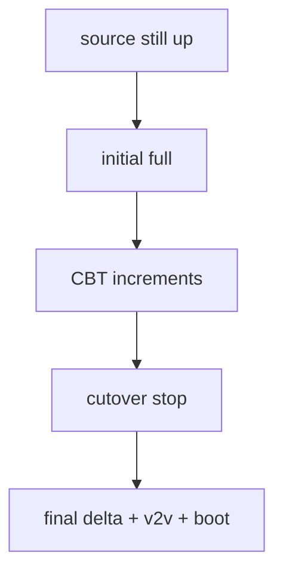
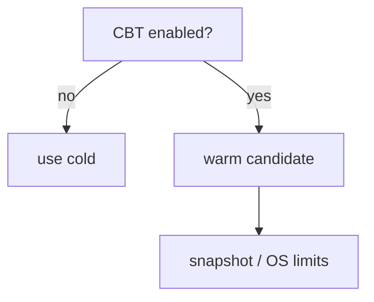
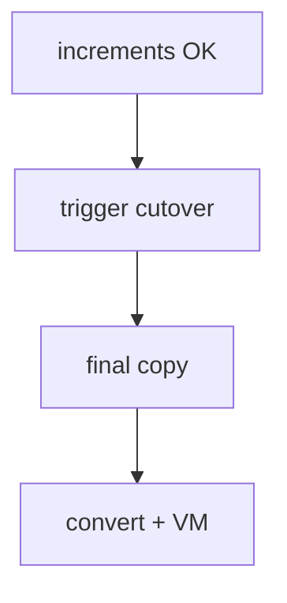
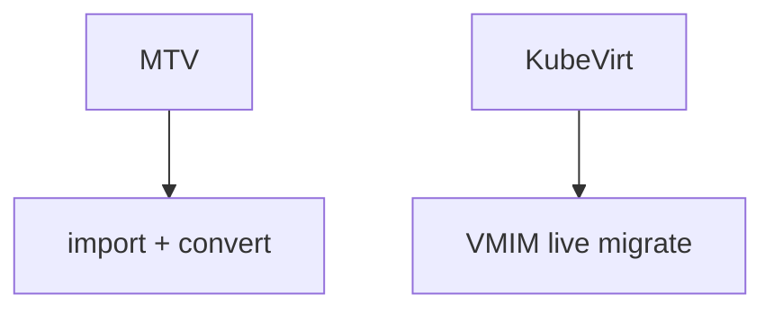
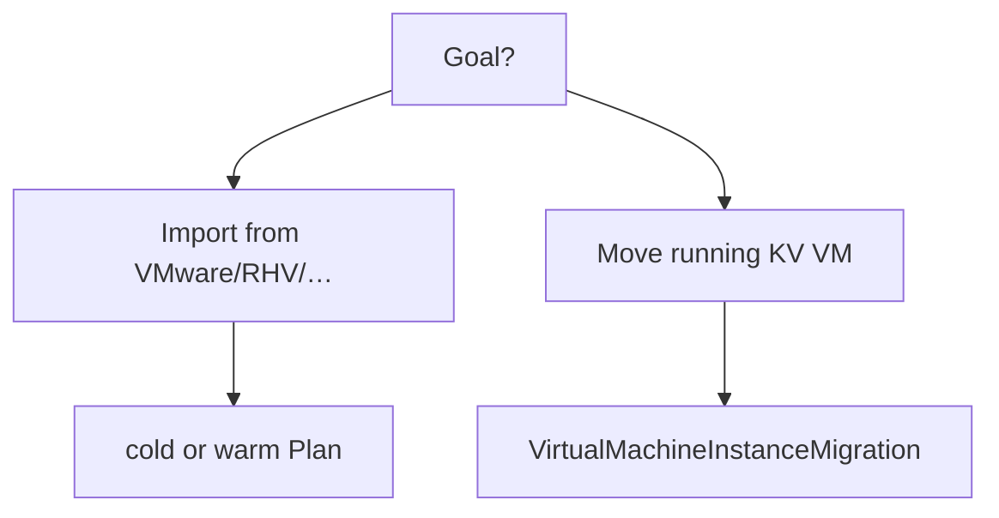

## !intro Warm vs cold

Plan mode chooses the downtime story. **Cold** maximizes simplicity; **warm** minimizes cutover downtime with CBT and a final delta. Neither is KubeVirt live migration between cluster nodes.

## !!steps Cold migration

Source workload is offline (or disk is static) for the copy window. Full disk transfer, then conversion, then VM create/boot. Often faster *total* elapsed time; guest downtime spans most of the copy.


## !!steps Warm migration

1. Initial full copy while source **keeps running**  
2. Periodic **CBT** incremental snapshots (default schedule on the order of an hour — product defaults vary)  
3. **Cutover**: stop source, final delta, convert, boot on target  

Downtime is concentrated at cutover, not the whole transfer.



## !!steps CBT constraints

Changed Block Tracking must be available on the source VM. Snapshot chains have limits (commonly discussed around dozens of snapshots — treat product docs as source of truth). Hibernated and some multi-boot guests are poor fits. Warm supports a narrower guest OS set than cold in practice.



## !!steps Cutover is an operator moment

Warm is not “set and forget zero downtime.” Someone triggers cutover when increments look healthy. Failed cutover leaves you reasoning about last good snapshot + PVC state — Plan conditions and migration pod logs, not virt-handler domain sync.



## !!steps Contrast: KubeVirt live migration

| | MTV warm/cold | KubeVirt live migrate |
|--|---------------|------------------------|
| Direction | Foreign hypervisor → cluster | Node → node (same cluster) |
| Object | Plan / import | VMIM |
| Guest | Often stopped at cutover | Stays up (pre-copy) |
| Disk | Copy/convert into PVC | Shared RWX or block migrate |



## !!steps Choosing a mode

- Need predictable ops, simpler failure modes → **cold**  
- Need short cutover, CBT healthy, supported guest → **warm**  
- Already on KubeVirt, moving nodes → **live migration**, not MTV  



## !!steps Failure symptoms

| Symptom | Look at |
|---------|---------|
| Stuck in copy | VDDK/importer pod, storage, network |
| Snapshots piling up | CBT / schedule / limits |
| Cutover fails | final delta, conversion log |
| Boots then wrong net | NetworkMap, not warm algorithm |

```go ! mode.go
// Teaching sketch — Plan mode is an import concern.
type PlanMode string
const (
	// !focus(4:5)
	PlanCold PlanMode = "cold"
	PlanWarm PlanMode = "warm"
)
```

## !outro Continue

When MTV finishes: VM hand-off, first boot, and triage across repos.
