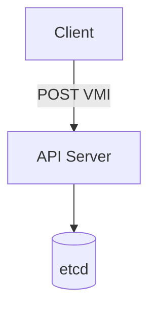
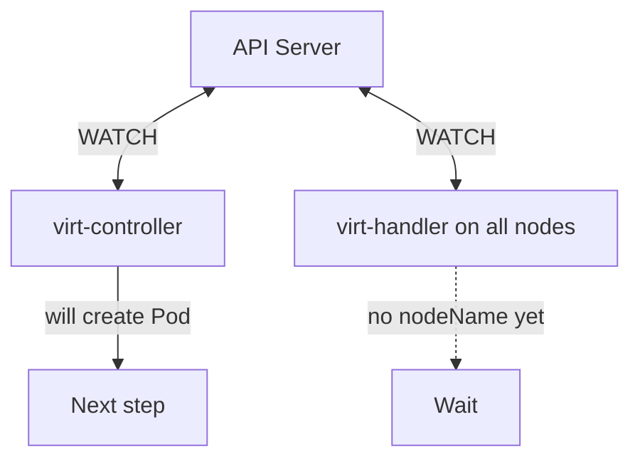
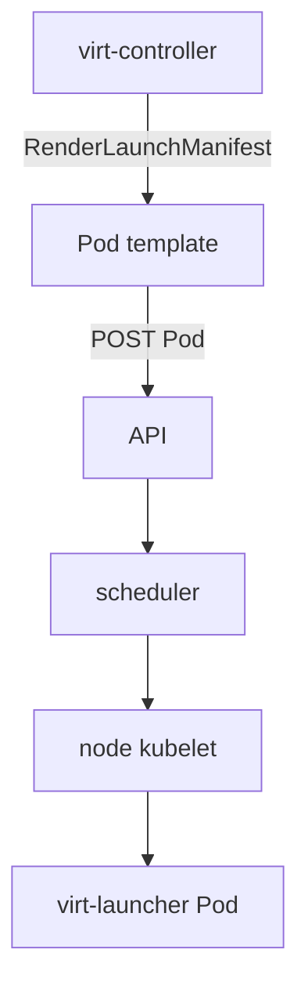
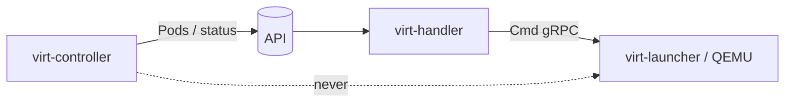
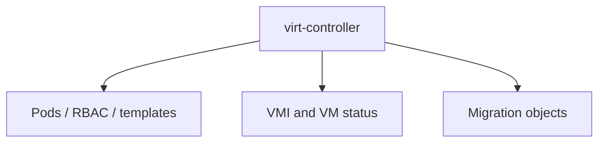
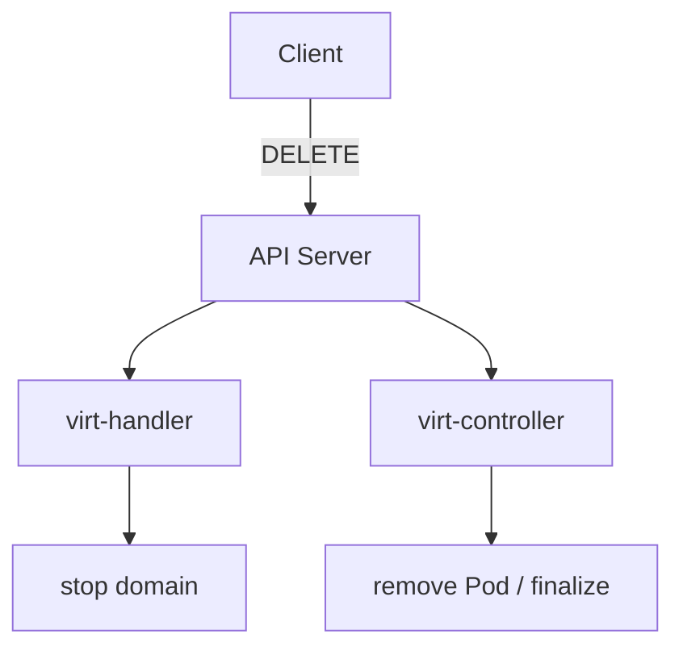

## !intro Control plane

The cluster side of KubeVirt decides *that* a VM should exist as a Pod on some node, and keeps Kubernetes objects consistent. It does not run QEMU itself.

## !!steps Entry: create a VMI

A client creates a `VirtualMachineInstance` (directly, or via a `VirtualMachine` controller). The apiserver validates and stores it. Nothing has started a guest yet — only an API object exists.



## !!steps Everyone watches

`virt-controller` and every `virt-handler` WATCH VMIs. Early on, the VMI usually has **no** `status.nodeName`, so handlers ignore it. The controller must create the virt-launcher Pod.



## !!steps virt-controller creates a Pod

The controller renders a Pod template (`pkg/virt-controller/services`) — volumes, devices, launcher image, containerDisk sidecars, resources — and creates it. The kube-scheduler binds the Pod to a node. Still no domain — only a Pod object (and eventually a running launcher container).



## !!steps Handoff: status.nodeName

When the Pod is scheduled, virt-controller updates the VMI so `status.nodeName` matches that node (and related labels). That field is the baton: **node-local work is now for virt-handler on that node**.

```go ! handoff.go
// Teaching sketch — the handoff signal on VMI status.
type VirtualMachineInstanceStatus struct {
	// !focus(1:2)
	NodeName string
	Phase    string // Scheduling → Scheduled → Running …
}
```

## !!steps Controller never touches QEMU

There is no SSH or RPC from virt-controller into the guest process. Cluster components speak Kubernetes objects; the node agent speaks to the launcher. If you find yourself wanting the controller to “tell QEMU X,” the design wants that on the handler/launcher path instead.



## !!steps What the controller keeps doing

Even after handoff, virt-controller still reconciles: Pod existence, some status, migrations coordination, VM↔VMI relationship, and reacting when objects are deleted. Think “cluster objects stay true,” not “controller SSH into QEMU.”



## !!steps Delete is reverse choreography

Delete the VMI (or stop the VM). Handlers shut down domains; controllers clean Pods and finalize objects. Same watch-and-act model — no single stop RPC from controller to QEMU.



## !outro Continue

How virt-handler and virt-launcher turn a scheduled VMI into a running guest.
