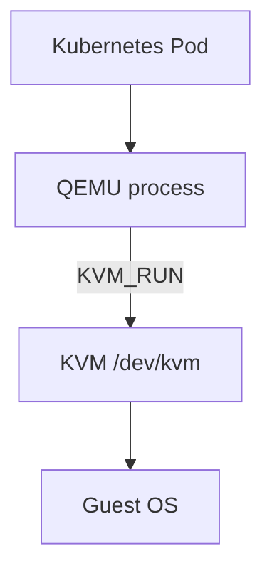
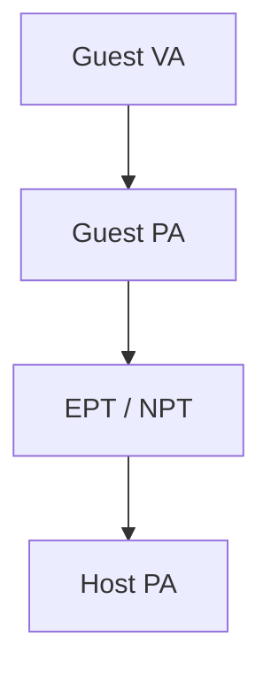
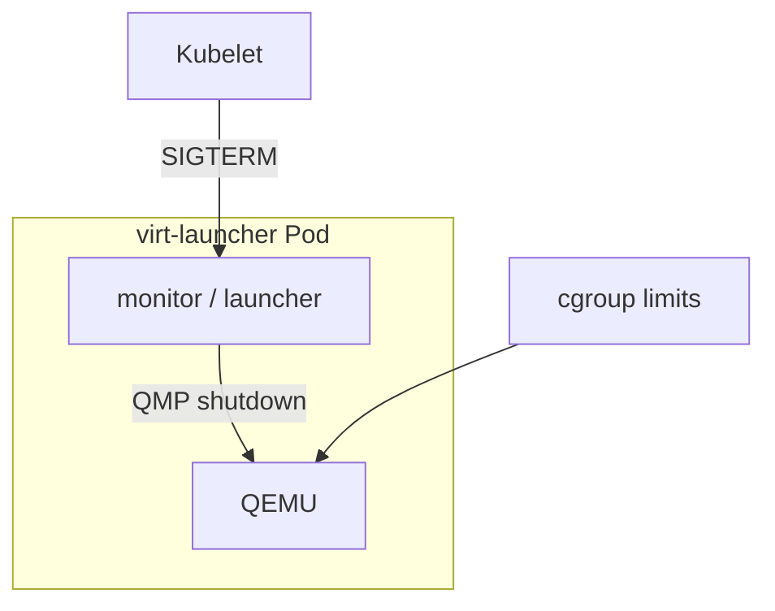
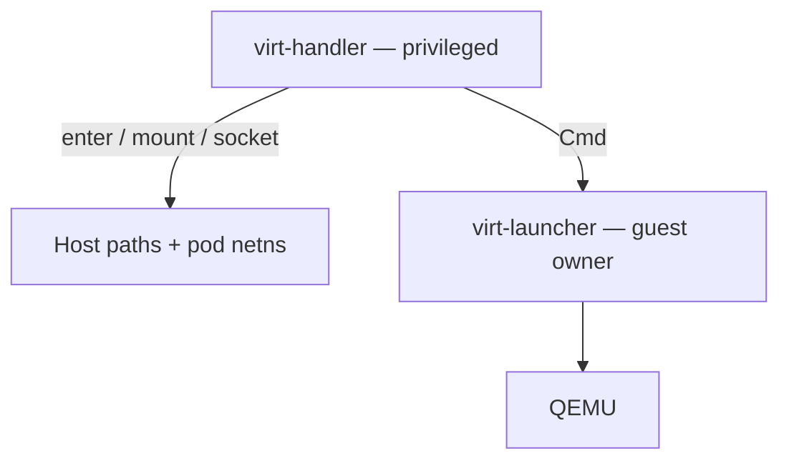
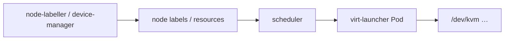

## !intro Isolation layers

KubeVirt works because a guest is isolated several times: by the CPU, by memory translation, by the IOMMU for devices, and by the Pod’s namespaces and cgroups. The privileged **virt-handler** sits outside that Pod sandbox on purpose.

## !!steps Why QEMU-in-a-Pod works

A KVM guest is a Linux process (QEMU) with vCPU threads calling `KVM_RUN`. Kubernetes already knows how to schedule, account, and kill processes inside Pods. Put QEMU in a Pod and the cluster sees a workload; KVM still provides the hardware VM. That is the fundamental insight.

## !!steps Layer 1: CPU non-root mode

While the guest runs, the CPU is in VT-x/AMD-V **non-root** mode. Privileged ops VMEXIT to the host. The guest cannot rewrite the VMCS or escape to host root mode by executing a clever instruction — the hardware boundary is the first wall.

## !!steps Layer 2: EPT / NPT memory

Guest physical addresses are translated through EPT/NPT to host memory. Even a fully compromised guest kernel only reaches the slots KVM mapped for that VM. (QEMU’s own address space is a second concern — that is why later layers lock down the process.)

## !!steps Layer 3: IOMMU for devices

Passthrough devices DMA without the CPU. The IOMMU restricts those DMA addresses to the VM’s memory. Without it, a passed-through NIC could read host memory. Host devices and SR-IOV paths assume this layer.

## !!steps Layer 4: Pod sandbox

Namespaces, cgroups, seccomp, and SELinux wrap QEMU like any other containerized process. CPU/memory quotas apply to vCPU threads. SIGTERM to the Pod hits the launcher monitor, which can request graceful guest shutdown before kubelet escalates.

## !!steps Handler holds privilege; launcher holds namespaces

virt-handler runs privileged with hostPID (and related access) so it can find pod volume paths, mount disks, and talk on host sockets. The launcher stays comparatively unprivileged and owns the guest process tree. Reviewers push host-facing work toward the handler, not into the launcher image.

## !!steps Device plugins

`/dev/kvm`, tun, vhost-net, and similar are often allocated via device plugins so the scheduler knows which nodes can run VMs and so Pods get the right device nodes. Node labeller and device-manager under virt-handler advertise capacity; the Pod template consumes it.

## !outro Continue

How disks actually show up inside that sandbox — containerDisk vs PVC — and where CDI fits.
