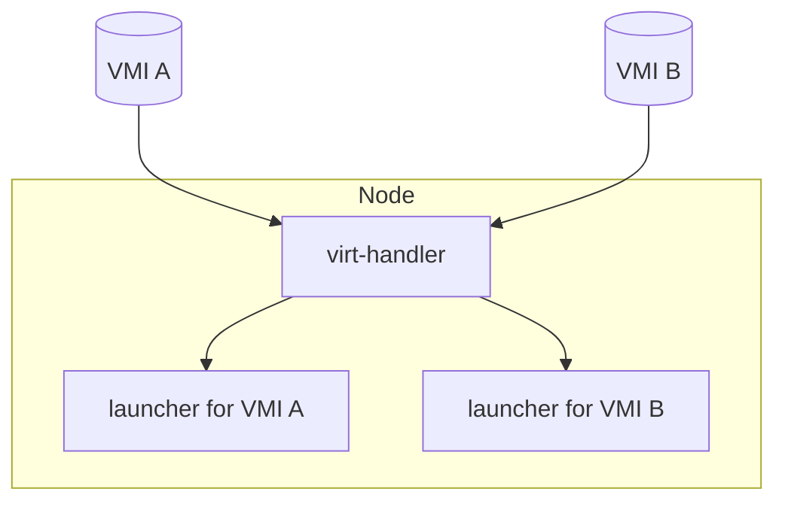
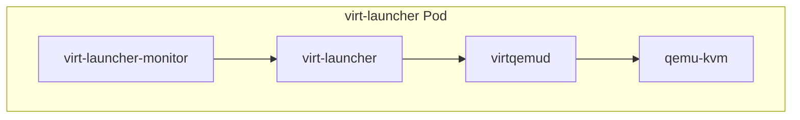
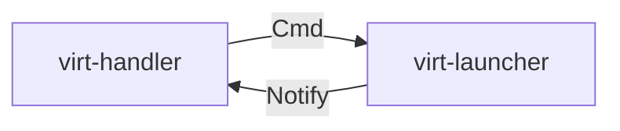
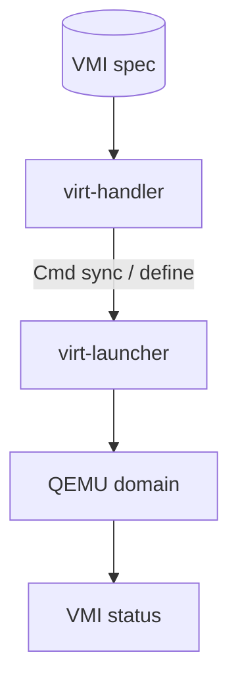
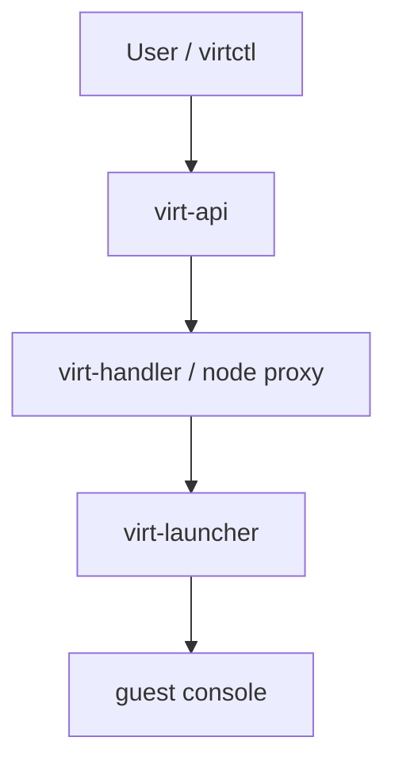
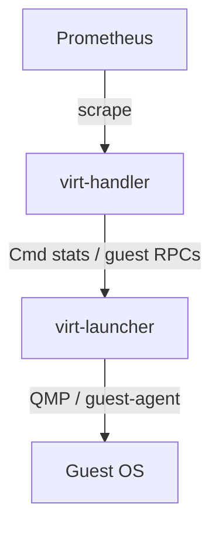
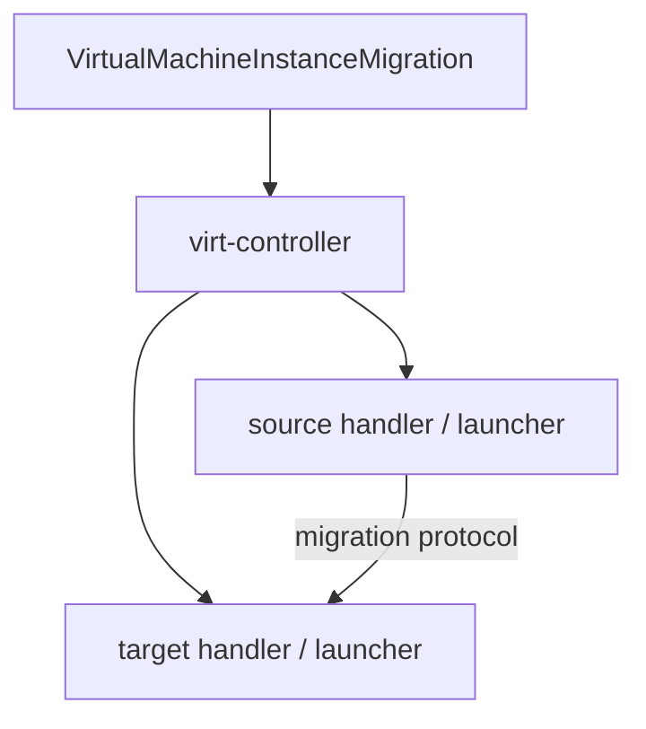

## !intro Node path

After `status.nodeName` is set, **virt-handler** on that node owns domain lifecycle. QEMU runs inside a **virt-launcher** Pod. They talk over local gRPC — not through the Kubernetes apiserver for every VMI action.

## !!steps virt-handler: one per node

virt-handler is a DaemonSet. It selects VMIs for its node, syncs each launcher, and exposes node-level metrics. It must stay up for many VMs, so per-VM blast radius is pushed into the launcher Pod. The handler is privileged enough to reach host paths and enter pod namespaces; the launcher is not.

## !!steps virt-launcher: one per VMI

The launcher Pod owns one guest. PID 1 is typically **virt-launcher-monitor**, which supervises **virt-launcher**, which talks to a per-pod **virtqemud** (not a host-wide libvirtd). That daemon owns the single QEMU process. If QEMU dies, the Pod fails — other VMs on the node keep running.

## !!steps Cmd vs Notify

Two directions under `pkg/handler-launcher-com`:

- **Cmd** — handler → launcher (sync domain, stats, guest RPCs, …)
- **Notify** — launcher → handler (domain lifecycle events)

Keep JSON and libvirt XML details inside the launcher when you can; keep RPC payloads boring and version-tolerant. Socket path layout matters for mixed-version upgrades.

## !!steps Syncing a domain

Handler turns the VMI spec into a desired domain and asks the launcher to reconcile (define/start/update). Launcher drives virtqemud. Phase and conditions on the VMI reflect progress and failures.

## !!steps Consoles and subresources

Interactive paths (serial console, VNC) typically go through **virt-api** subresources, then to the right node/launcher — not through virt-controller’s reconcile loop. When fixing console bugs, start at virt-api and the launcher endpoint, not the Pod template alone.

## !!steps Guest agent and stats

Optional guest agent inside the VM reports users, filesystems, network interfaces, device drivers, and more. The launcher polls the agent; the handler scrapes structured results for status and Prometheus metrics.

## !!steps Migrations in one picture

Live migration adds migration objects and coordination, but the data plane is still node agents moving a domain between launchers. Controllers set up the intent; handlers and launchers execute the transfer. The next section goes deep.

## !outro Continue

Why a QEMU-in-Pod design works: hardware isolation, Kubernetes isolation, and the privileged handler’s job on the host.
