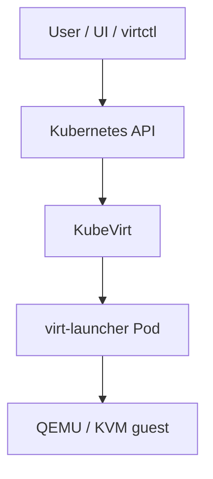
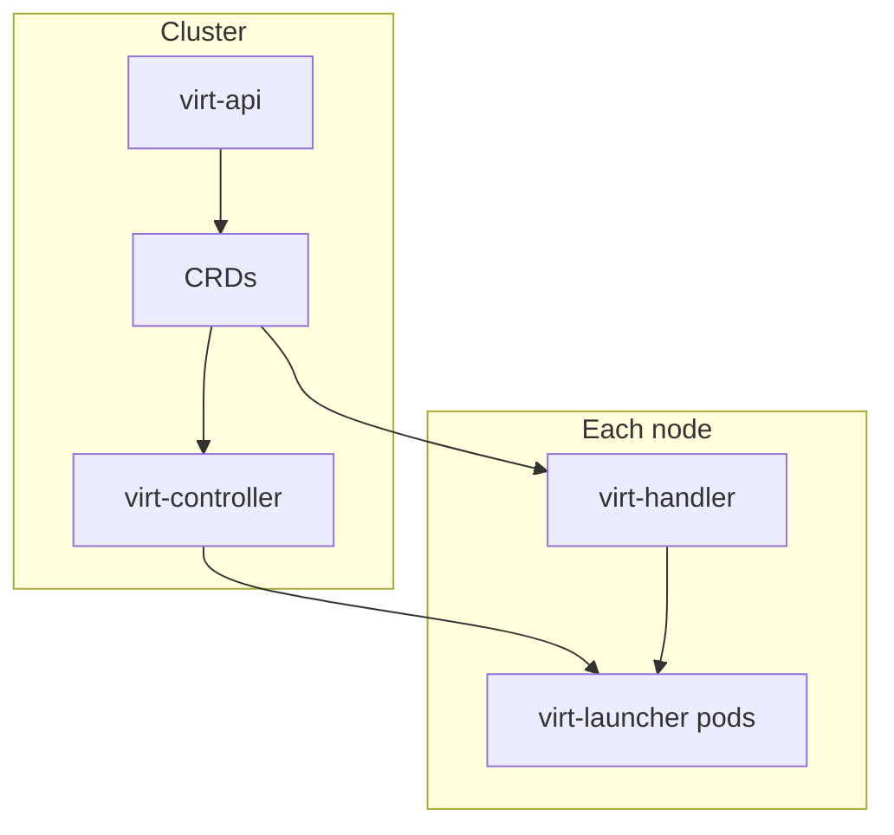
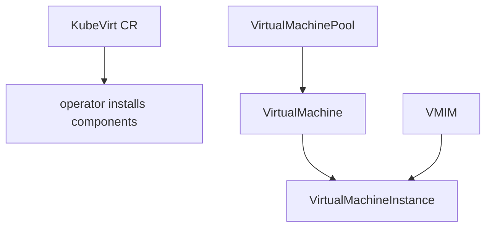
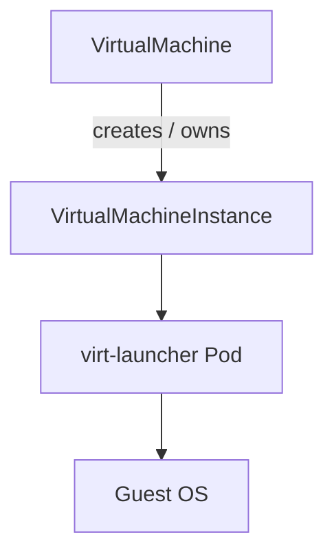
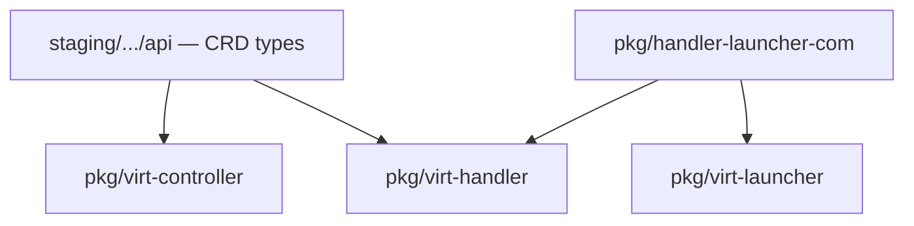
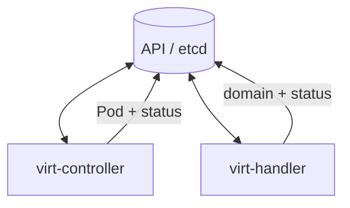
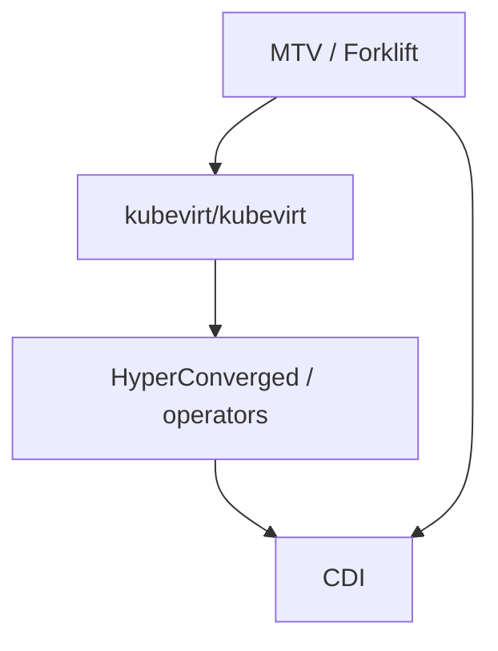

## !intro What KubeVirt is

KubeVirt runs virtual machines as first-class workloads on Kubernetes. As a maintainer you will change Go under [kubevirt/kubevirt](https://github.com/kubevirt/kubevirt): APIs, controllers, node agents, and the per-VM launcher. This chapter is the map.

Scroll each step; the panel follows with a diagram or a small code sketch.

## !!steps The problem it solves

Kubernetes schedules containers. People also need **VMs** (Windows, full kernels, live migration, PCI passthrough). KubeVirt adds VM APIs and the runtime that turns those APIs into QEMU processes, while still using Kubernetes for scheduling, networking, and storage.

## !!steps What lands on a cluster

Installing KubeVirt (often via the KubeVirt operator or HyperConverged) adds roughly:

1. **CRDs** — `VirtualMachine`, `VirtualMachineInstance`, migrations, pools, …
2. **virt-controller** — cluster-wide reconciliation
3. **virt-handler** — DaemonSet on every node
4. **virt-api** — subresources (console, VNC, …) and webhooks
5. **Per-VM pods** — virt-launcher, created when a VMI should run

## !!steps Core CRDs you will touch

Beyond VM and VMI, the API surface includes objects that show up in reviews constantly:

| CRD | Role |
|-----|------|
| `VirtualMachine` | Desired machine; start/stop / RunStrategy |
| `VirtualMachineInstance` | Concrete instance the runtime drives |
| `VirtualMachineInstanceMigration` | Live migration intent |
| `VirtualMachinePool` | Fleet of VMs (preferred over legacy VMIRS) |
| `VirtualMachineInstancetype` / `Preference` | CPU/memory and OS tuning presets |
| `KubeVirt` | Cluster install/config (operator) |

Most runtime bugs still land on the **VMI** path; most product UX is expressed as a **VM**.

## !!steps VM vs VMI

Two objects you will see constantly:

- **`VirtualMachine` (VM)** — desired machine that can be stopped/started; owns higher-level lifecycle
- **`VirtualMachineInstance` (VMI)** — a concrete running (or attempting) instance

Most of the runtime path (Pod, handler, launcher) is about the **VMI**. Controllers create and update VMIs from VMs.

## !!steps Where code lives

A simplified maintainer map of the repo:

| Area | Role |
|------|------|
| `staging/src/kubevirt.io/api` | Public CRD Go types |
| `pkg/virt-controller` | Cluster reconciliation, Pod creation |
| `pkg/virt-handler` | Node agent, domain sync, metrics |
| `pkg/virt-launcher` | Per-VM process, virtqemud/QEMU, guest agent |
| `pkg/virt-api` | Subresource API + webhooks |
| `pkg/handler-launcher-com` | gRPC contracts (handler ↔ launcher) |
| `tests/` | Functional / e2e style coverage |
| `hack/` | generate, build, CI helpers |

## !!steps Choreography, not a monolith

KubeVirt is **watch-and-act**: components observe API objects and converge independently. There is rarely one function that “creates a VM end to end.” When debugging, ask *which watcher* should have reacted, and whether status fields (especially `nodeName`) have advanced.

## !!steps Product vs upstream

**Upstream KubeVirt** is the open project. **OpenShift Virtualization** (and community HyperConverged) package operators, UI, CDI, and MTV on top. Core sections of this site teach **upstream runtime code**. The **Ecosystem** section covers sibling repos (CDI, MTV/Forklift, packaging) once the core map is solid.

## !outro Continue

What happens when someone creates a VMI, from the API to a scheduled Pod and the `nodeName` handoff.
