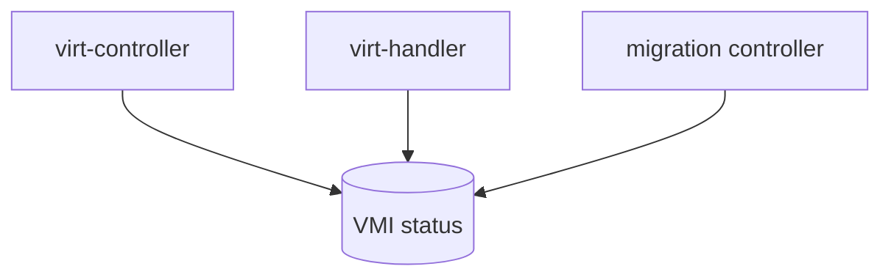
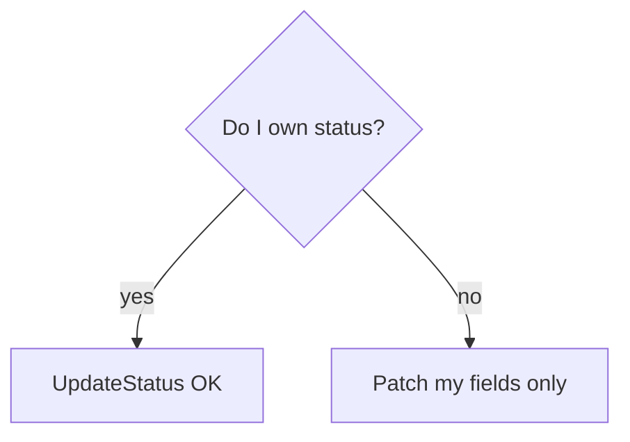
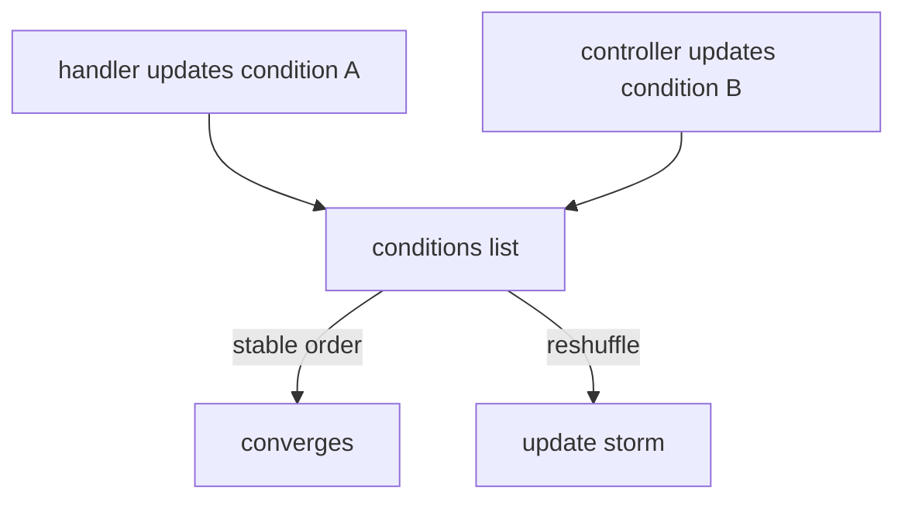
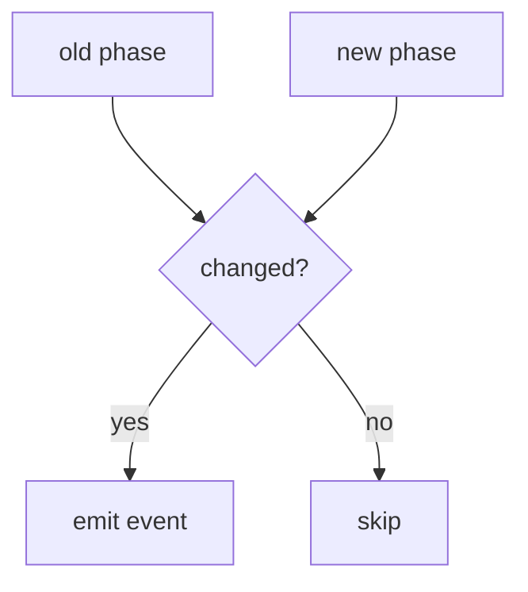
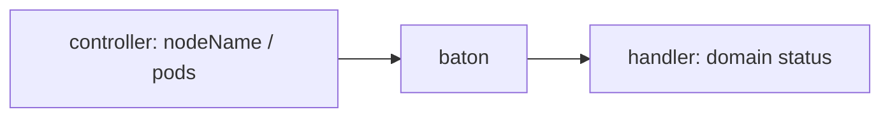
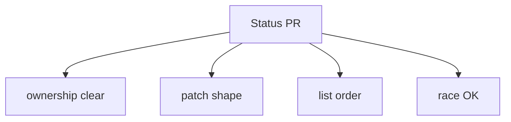

## !intro Status ownership

Several components update the same VMI. If everyone `Update`s the whole object, you get lost fields and update storms. Maintainers treat **who owns which status fields** and **Patch vs Update** as design, not style.

## !!steps Multi-writer reality

Typical writers:

- **virt-controller** — Pod linkage, some phase/conditions, migration coordination fields  
- **virt-handler** — domain-reflecting status, guest info, node-local conditions  
- **migration controller** — migration progress on the VMI (via patch)  

Spec/metadata ownership is usually clearer; status is the battlefield.



## !!steps Patch when you do not own the object

Reviewer rule: if your controller did not create the object, **Patch** the fields you care about — do not read/modify/`Update` the whole struct. Migration controller patching a VMI is the canonical example. Full Update after a typed decode can drop unknown fields.

```go ! patch.go
// Teaching sketch — narrow patch, not full update.
patch := []byte("{\"status\":{\"migrationState\":{...}}}")
// !focus(1:1)
client.Patch(ctx, vmi, patch, "application/merge-patch+json")
```

## !!steps Status: own it or patch it

If a controller **owns** status, `UpdateStatus` is fine. If it only contributes a slice of status, Patch. Ambiguous ownership is how two loops fight forever.



## !!steps Condition list order matters

virt-handler and virt-controller both touch `status.conditions`. If each rewrite shuffles order, every reconcile looks like a change → **update storm**. Preserve order; update in place; do not sort casually.



## !!steps Phase and events

Fire Kubernetes events on **transitions**, not every time the loop sees `Running`. Same idea as conditions: compare old vs new. Duplicate events hammer the apiserver and hide the real timeline in `kubectl describe`.



## !!steps nodeName and ActivePods

Handoff fields are not free-for-all. Controller sets `nodeName` when the Pod schedules; migration updates `ActivePods` as source/target appear. Handler must not “helpfully” invent cluster scheduling truth. Know the baton before patching phase.



## !!steps Practical review checklist

Before approving a status change:

1. Who else writes this field?  
2. Patch or UpdateStatus — justified?  
3. Conditions order preserved?  
4. Events transition-gated?  
5. Survives handler + controller racing?



## !outro Continue

Platform ops: how the operator installs and updates the control plane without breaking that contract.
