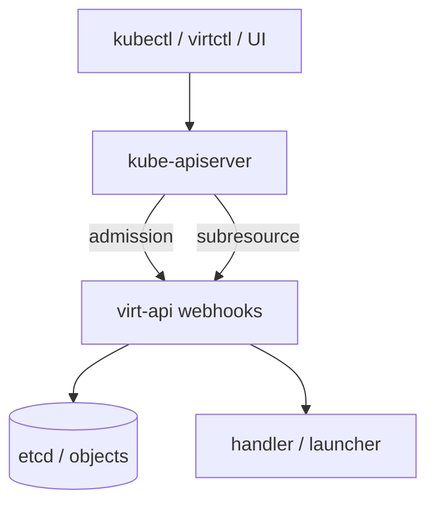
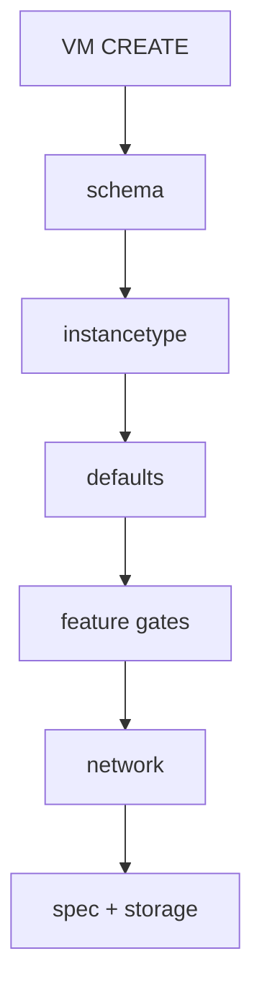
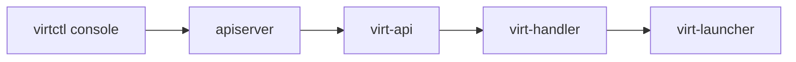
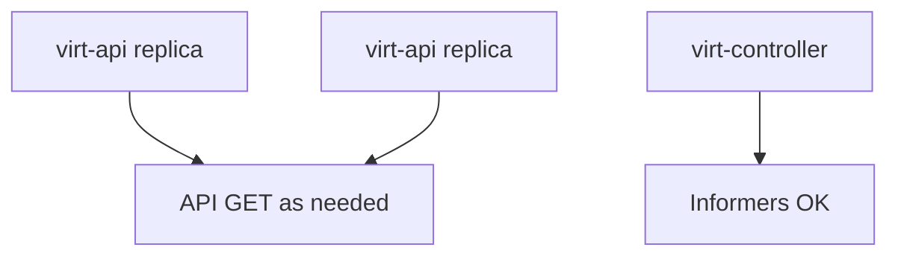
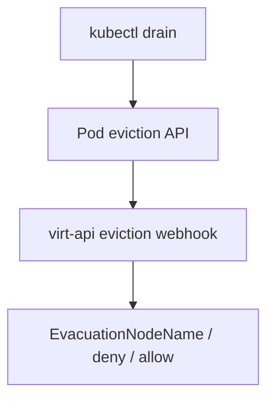
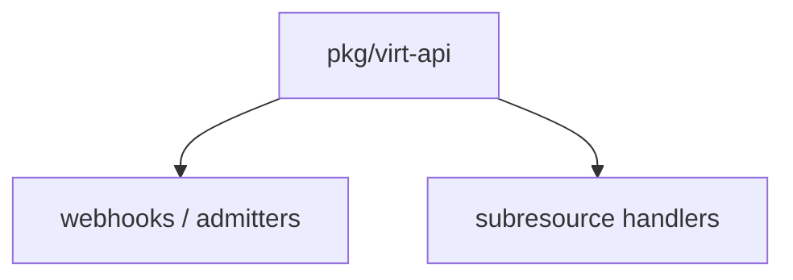

## !intro virt-api: admit then proxy

**virt-api** is the HTTP face of KubeVirt: admission webhooks that keep bad specs out, and **subresources** that proxy interactive and lifecycle operations. It is not the reconciler — that is virt-controller — and it should not grow heavy informer caches.

## !!steps Two jobs

1. **Admit** — validating/mutating webhooks on VM, VMI, migration, snapshot, …  
2. **Proxy** — subresources: `/console`, `/vnc`, `/portforward`, `/start`, `/stop`, `/restart`, `/migrate`, freeze, volume ops, …

Cluster CRD traffic still hits the apiserver; virt-api is registered as webhooks and as the subresource backend.



## !!steps Admission pipeline (sketch)

On VM create, admitters roughly: schema → instancetype/preference expand → defaults → feature gates → network → full spec → storage → volume requests → deprecation warnings. Failures become admission errors; soft issues become warnings `kubectl` shows.



## !!steps Subresources vs reconcile

`virtctl console` does not wait for the next reconcile loop. The apiserver forwards to virt-api, which finds the right node/launcher and streams. When console/VNC breaks, start at virt-api and the launcher endpoint — not Pod template YAML alone.



## !!steps Start / stop / migrate subresources

Lifecycle subresources mutate VM/VMI/VMIM intent the same way a careful client would — then controllers converge. They are ergonomic API, not a second control plane. Prefer them (or declarative RunStrategy) over hand-editing status.

```go ! subresource.go
// Teaching sketch — operations surface on the API, not on QEMU RPC from the client.
const (
	// !focus(1:5)
	SubresourceStart   = "start"
	SubresourceStop    = "stop"
	SubresourceRestart = "restart"
	SubresourceMigrate = "migrate"
	SubresourceConsole = "console"
)
```

## !!steps No informers at scale

Reviewer guide: virt-api scales without leader election. Precaching the world with informers multiplies watch traffic across replicas. Prefer targeted GETs during webhook/subresource handling. Controllers and operator own informers; virt-api does not.



## !!steps Eviction webhook lives here too

virt-api also intercepts **pod eviction** requests cluster-wide (next platform chapter). Same binary, different concern: admission of disruption, not of VM YAML. Know that “virt-api down” changes drain behavior via failurePolicy.



## !!steps Where to look

| Area | Path |
|------|------|
| Server wiring | `pkg/virt-api` |
| VM admitter | `…/admitters/vms-admitter.go` |
| VMI create | `…/vmi-create-admitter.go` |
| Subresources | rest handlers under `pkg/virt-api` |



## !outro Continue

Who may write VMI status, and why Patch vs Update shows up in every serious review.
