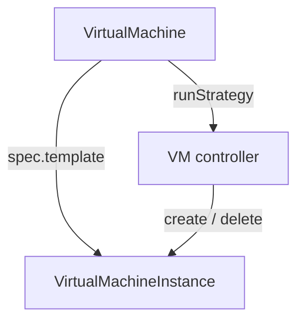
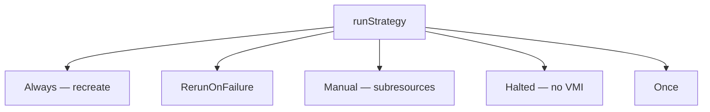
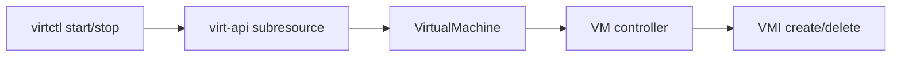
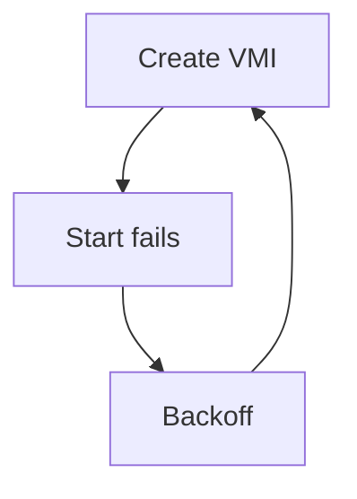
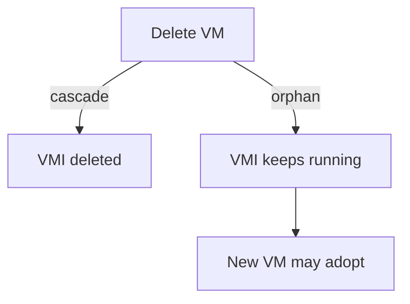
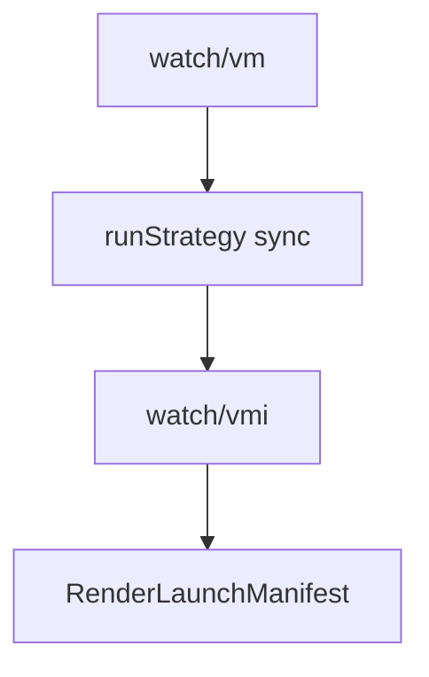

## !intro VM and RunStrategy

Production clusters mostly manage **VirtualMachines**, not raw VMIs. The VM controller (`pkg/virt-controller/watch/vm`) turns desired power state — **RunStrategy** — into create/delete of VMIs. The runtime path you already know starts after a VMI exists.

## !!steps VM owns the template

A VM stores a VMI template (`spec.template`) plus lifecycle knobs. Starting means “ensure a VMI exists from that template.” Stopping means “ensure that VMI is gone” (with cascade/orphan nuances). Status on the VM summarizes printable state, conditions, and the current VMI name.



## !!steps RunStrategy matrix

| Strategy | Intent |
|----------|--------|
| `Always` | Keep a VMI running; recreate if it disappears |
| `RerunOnFailure` | Restart only after failure (not after clean shutdown) |
| `Manual` | Imperative start/stop via subresources; no auto recreate |
| `Halted` | No VMI; machine is off |
| `Once` | Run until it stops; do not restart |
| `WaitAsReceiver` | Special case for decentralized / sync migration receive |

Deprecated `spec.running: true/false` still appears in the wild — admitters warn; prefer `runStrategy`.



## !!steps Always vs Halted

Patch `runStrategy` to `Always` → controller creates a VMI from the template → control-plane + node path run. Patch to `Halted` → controller deletes the VMI → domain stops, Pod goes away. That is the declarative on/off switch most operators use.

```go ! patch.go
// Teaching sketch — declarative power.
patch := map[string]any{
	"spec": map[string]any{
		// !focus(1:1)
		"runStrategy": "Always", // or "Halted"
	},
}
```

## !!steps Manual and subresources

With `Manual`, virtctl/`/start` `/stop` `/restart` subresources drive transitions without the Always recreate loop. Useful when an external controller owns power state. The VM controller still reconciles; it just does not invent starts on its own.



## !!steps Start failure and backoff

If a VMI repeatedly fails to start, the VM controller backs off instead of hot-looping create/delete. Look at VM conditions and events when “Always but never Running” — it may be waiting out a start failure, not ignoring the strategy.



## !!steps Orphan vs cascade delete

Deleting a VM with cascade removes the VMI (and thus the guest). Orphan delete detaches a running VMI; recreating a matching VM can adopt it. Know which clients use which — console “delete VM” vs `kubectl delete --cascade=orphan`.



## !!steps Where to read the code

Start at `pkg/virt-controller/watch/vm` (`syncRunStrategy` and friends). Resist teaching the controller to talk to QEMU — it only manipulates VM/VMI/Pod objects. Power policy lives here; domain truth still lives on the node path.



## !outro Continue

How virt-api admits those objects and proxies console, VNC, start/stop, and friends.
