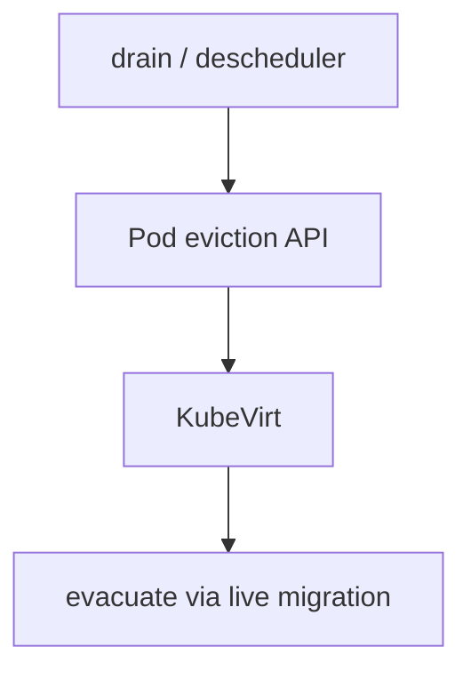
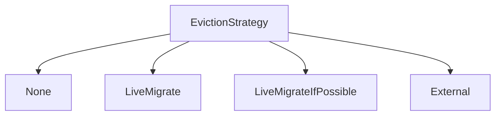
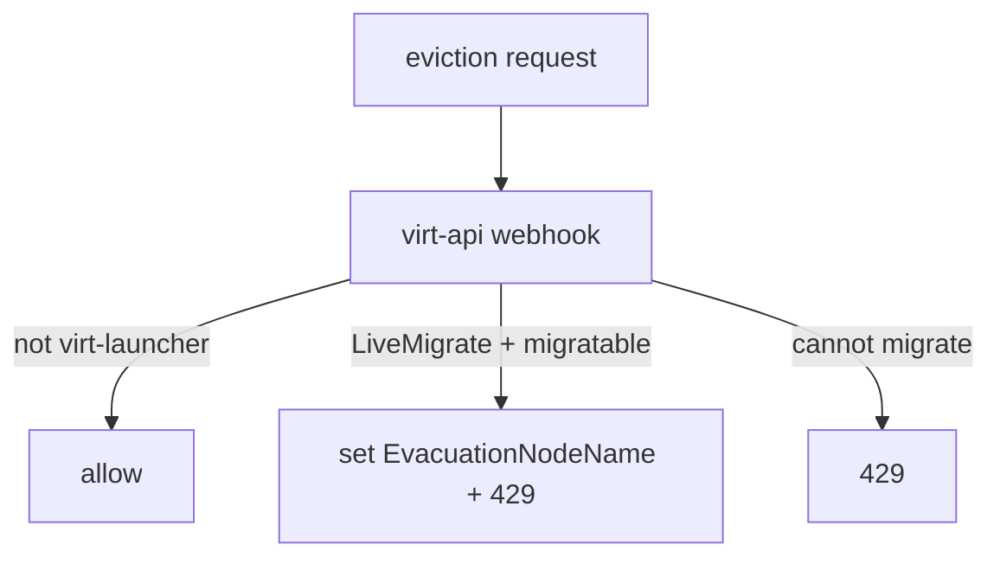
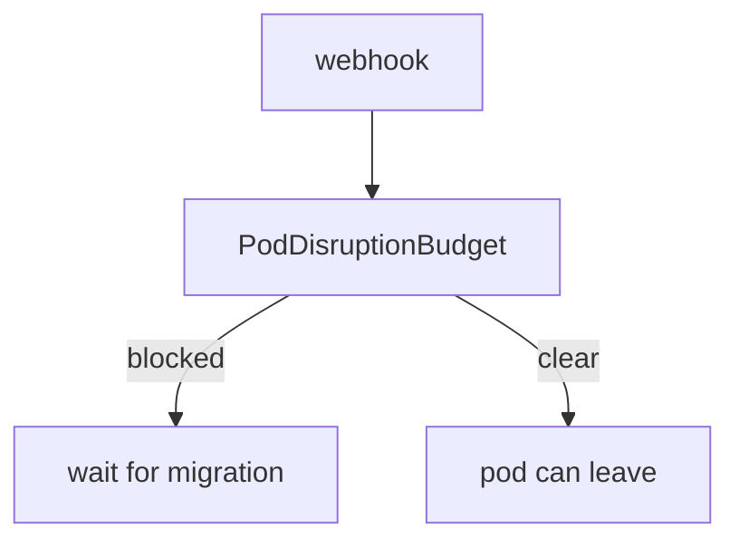
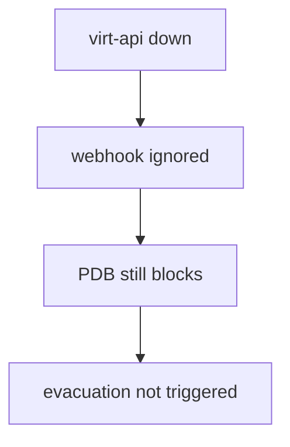
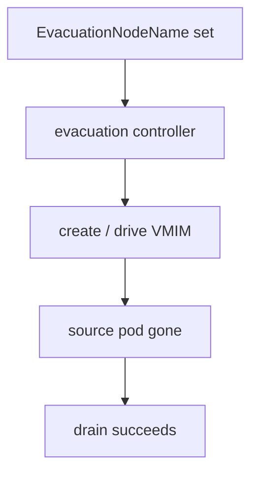

## !intro Evacuation and disruption

Kubernetes **evicts pods** (`kubectl drain`, descheduler). virt-launcher Pods need special handling so a drain becomes a **live migration** (evacuation) instead of a blind kill. virt-api’s eviction webhook + PDBs + the evacuation controller form that chain.

## !!steps Eviction vs evacuation

**Eviction** — Kubernetes API ask to remove a Pod.  
**Evacuation** — KubeVirt’s response: mark the VMI and migrate it off the node when strategy says so. Guests are not ordinary Pods; SIGTERM alone is a bad Day-2 story for VMs that should move.



## !!steps EvictionStrategy

On the VMI (or cluster default on the KubeVirt CR):

| Strategy | Behavior |
|----------|----------|
| `None` | Allow eviction; RunStrategy decides restart/shutdown |
| `LiveMigrate` | Trigger evacuation; deny eviction until safe |
| `LiveMigrateIfPossible` | Migrate if migratable; else behave like None |
| `External` | PDB + set `EvacuationNodeName`; external controller tears down |



## !!steps Eviction webhook (virt-api)

A validating webhook intercepts **all** cluster eviction requests. For virt-launcher (and hotplug) pods it may set `status.EvacuationNodeName`, return **429** (deny, retry), or allow. Non-virt pods pass through. Runs **before** PDB checks.



## !!steps PDB backup

Disruption Budget controller protects launchers that must not disappear mid-evacuate. Even if the webhook **allows** a later eviction try, PDB can still block until migration finishes. During migration, PDB coverage often expands to source **and** target pods.



## !!steps failurePolicy=Ignore

If virt-api is unreachable, the eviction webhook is **ignored** (request treated as approved by the webhook). PDBs still protect migratable launchers — but **evacuation may not start**. Drain can stall on PDBs without migrations. Operationally: keep virt-api healthy during maintenance windows.



## !!steps Evacuation controller

virt-controller watches VMIs with `EvacuationNodeName` set and creates migrations to pull them off that node. Drain’s retry loop eventually succeeds after the source pod is gone post-migration. Read webhook messages on 429 — they often say evacuation was triggered.



## !!steps Hotplug pods

The webhook also prevents naive eviction of `hp-volume-*` attachment pods that would strand hotplug state. Volume hotplug and drain interact — platform chapter next.

```go ! hotplug.go
// Teaching sketch — eviction path special-cases attachment pods.
if isHotplugAttachmentPod(pod) {
	// !focus(3:4)
	return denyOrProtect(pod)
}
```

## !outro Continue

Volume hotplug attachment pods, device plugins, and why Day-2 attach is a controller problem.
