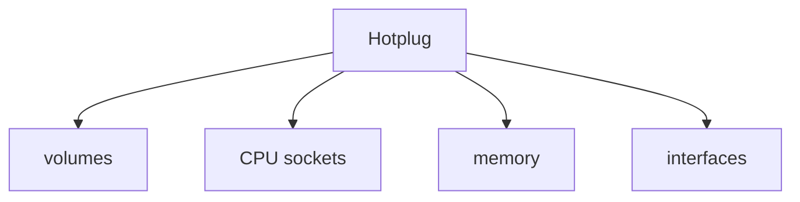
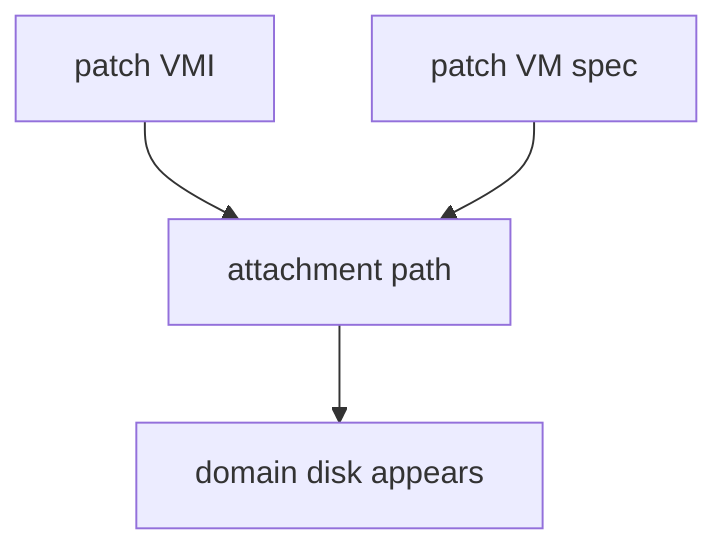
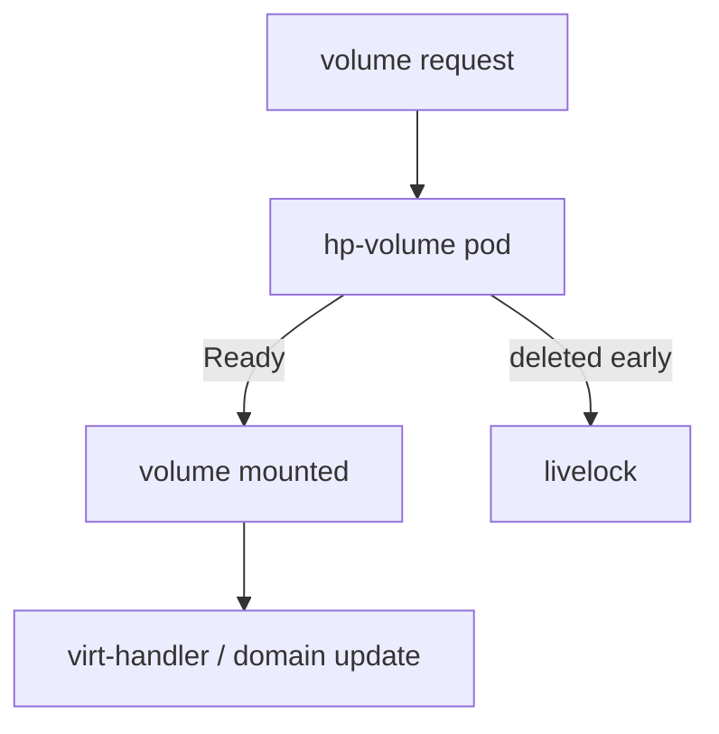
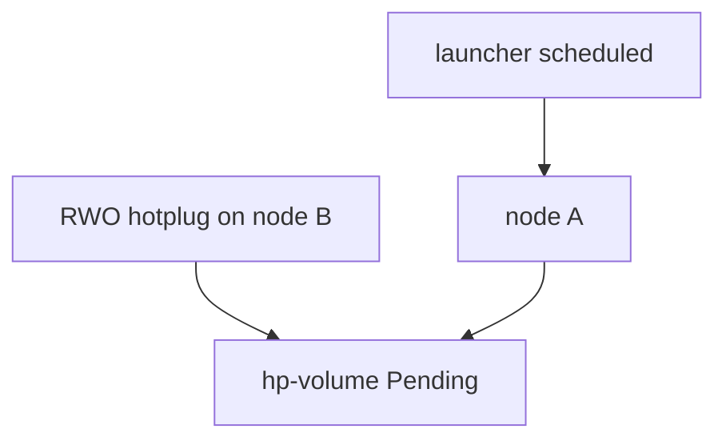
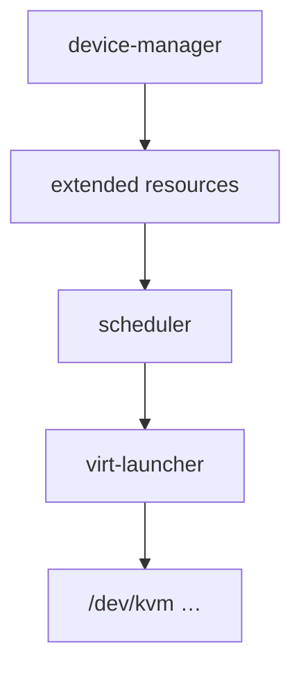
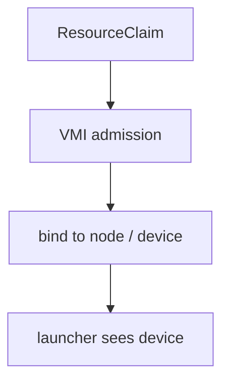
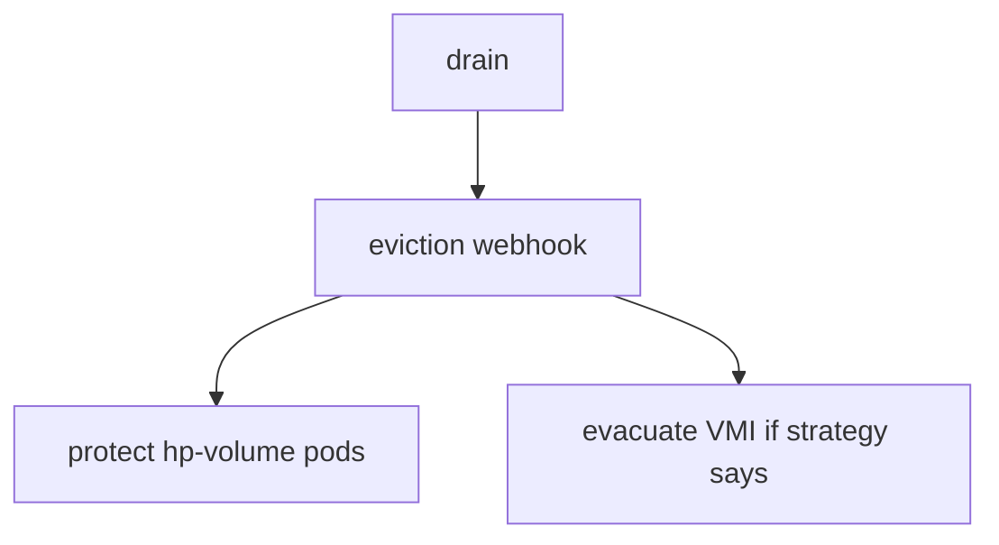

## !intro Hotplug and devices

Day-2 attach: disks, NICs, CPU/memory, and host devices. Volume hotplug is the most mature path and still full of controller edge cases. Host devices flow through **device-manager** / labeller (and increasingly **DRA**).

## !!steps What can hotplug

| Resource | Notes |
|----------|--------|
| Volumes (PVC/DV) | GA-ish; feature gates; attachment pods |
| CPU sockets | LiveUpdate rollout strategy |
| Memory | Add more common than shrink |
| Network interfaces | Bridge / SR-IOV variants |

Gates such as `HotplugVolumes`, `DeclarativeHotplugVolumes`, and `VMRolloutStrategy` show up in reviews constantly.

## !!steps Ephemeral vs declarative volumes

**Ephemeral** — patch the VMI; volume gone after restart.  
**Declarative** — patch the VM spec; survives restart.  
Both eventually need the volume visible inside the running domain — that is the attachment path.

## !!steps Attachment pods

Controller creates short-lived `hp-volume-*` pods to mount/attach volumes into the launcher’s world. virt-handler resolves paths and updates the domain. Rapid successive adds can livelock: pods deleted before Ready, nothing attaches until churn stops. Debounce and “don’t kill Pending too early” are real fix themes.

## !!steps Scheduler blind spots

Hotplugged RWO volumes are not always part of the original launcher scheduling decision. A VM on RWX root can land on a node where a later RWO hotplug cannot mount — attachment pod Pending forever. When debugging, ask whether the **volume’s node** matches the **VMI node**.

## !!steps Device plugins

virt-handler’s **device-manager** (and node-labeller) advertise `devices.kubevirt.io/kvm`, tun, vhost-net, GPUs, etc. The launcher Pod requests them so the scheduler only places VMs where devices exist. Privileged setup stays on the handler; the Pod receives device nodes.

## !!steps DRA sketch

Dynamic Resource Allocation claims are entering the VMI admission/scheduling story for more flexible device assignment. Treat DRA as evolving: admitter + claim binding + node path must agree. Read `pkg/dra` and host-device docs when a PR touches claims.

## !!steps Eviction and hotplug

Evacuation webhook protects attachment pods so drain does not yank a volume mid-attach. Hotplug + LiveMigrate strategies interact with RWX and binding gates from the data-plane chapters — a volume that cannot move blocks evacuation the same way a bridge binding does.

## !outro Continue

Sibling projects: ecosystem map, CDI, and MTV — how foreign VMs become KubeVirt workloads.
