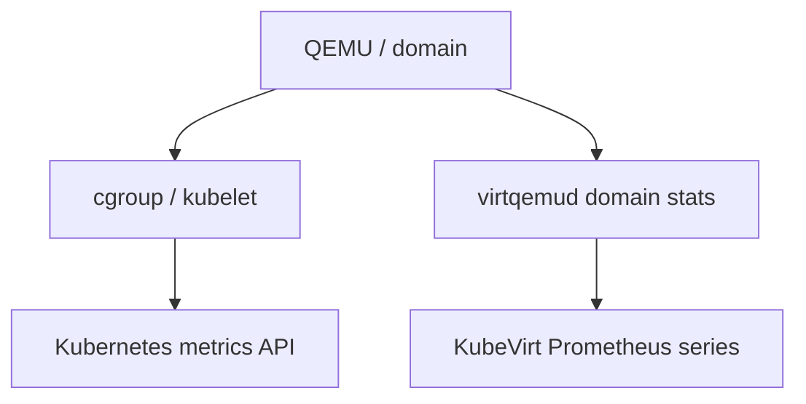
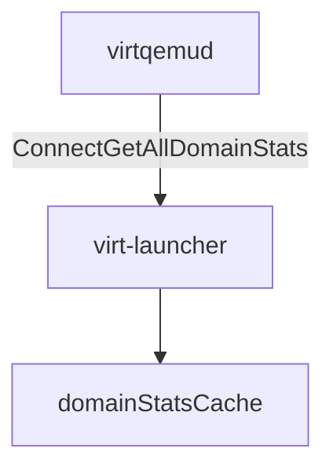
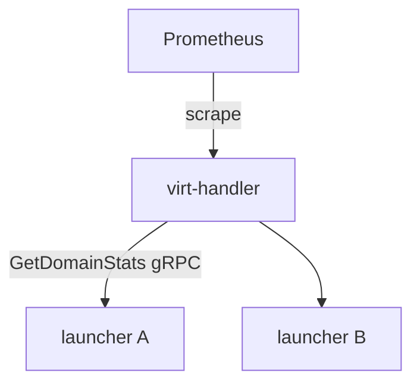
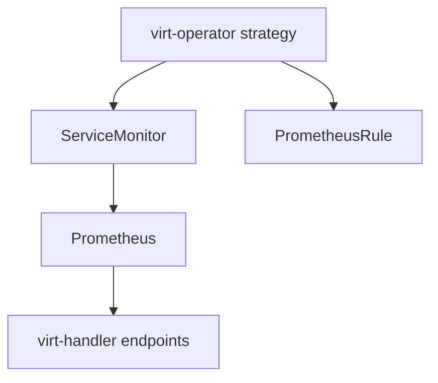
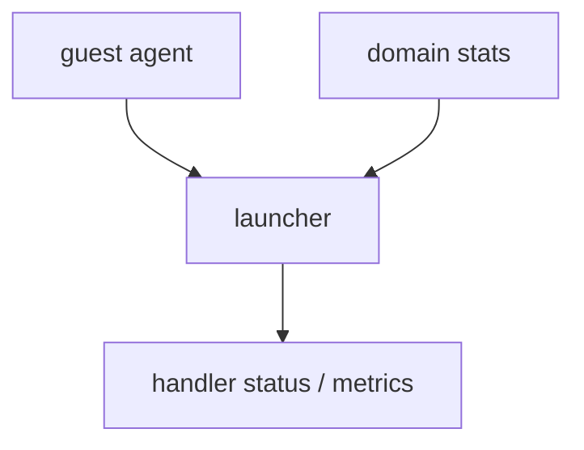
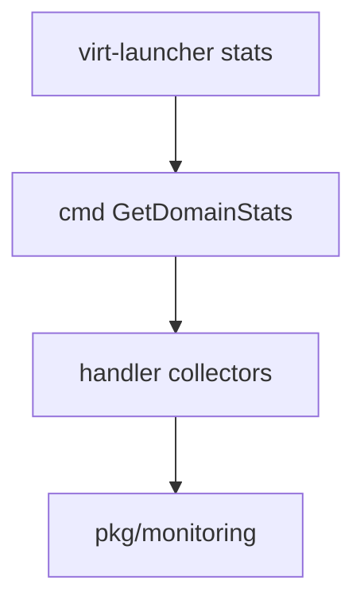

## !intro Metrics

VM “usage” is not one number. Kubernetes sees the **virt-launcher Pod** through cgroups; KubeVirt exposes **domain-level** stats through launcher → handler → Prometheus. Mixing the two paths is a classic triage mistake.

## !!steps Two paths, two truths

| Path | Source | Answers |
|------|--------|---------|
| Kubernetes | kubelet / cgroups on the compute container | Host view of QEMU process CPU/RSS (includes overhead) |
| KubeVirt | libvirt domain stats via gRPC | Guest/domain view: vCPU, balloon, disks, NICs, dirty rate |

`kubectl top pod` and empty console graphs can disagree — they often measure different things.



## !!steps Launcher caches domain stats

virt-launcher polls virtqemud (on the order of a few seconds) for domain stats: CPU total, per-vCPU, balloon/memory, block, interface, dirty rate, plus richer memory breakdowns. Results sit in a short-lived cache so handler scrapes do not hammer libvirt on every collect.



## !!steps Handler pulls over Cmd

virt-handler’s metrics collectors call **GetDomainStats** (and related RPCs) on each local launcher. Prometheus scrapes **virt-handler**, not every launcher Pod. That keeps scrape cardinality on the DaemonSet and reuses the same Cmd channel as domain sync.



## !!steps What series are for

Domain metrics feed VM overview graphs, alerting rules, and migration heuristics (dirty rate). Pod metrics feed scheduling pressure and “is the sandbox huge?” questions. When adding a series, decide which truth you are publishing — and which labels (`namespace`, `name`, node, …) must stay stable.

```go ! series.go
// Teaching sketch — domain stats become Prometheus series on the handler.
type DomainStatSeries struct {
	// !focus(1:3)
	Name   string // e.g. kubevirt_vmi_vcpu_seconds_total
	Help   string
	Labels []string
}
```

## !!steps Operator wires scrape and rules

If ServiceMonitor / PrometheusRule CRDs (and a known monitoring SA/namespace) exist when virt-operator builds its install strategy, it emits scrape config and alert rules. Install monitoring **after** KubeVirt and those objects may be missing until the strategy is regenerated — empty dashboards with healthy VMs.



## !!steps Guest agent is another channel

Guest-agent info (users, filesystems, some device/driver facts) is not the same as libvirt domain stats. Agent-down can starve status fields and some metrics while cgroup and domain CPU series still look fine. Prefer “which channel died?” over “metrics are broken.”



## !!steps Where to change code

| Concern | Start |
|---------|--------|
| Collect / cache stats | `pkg/virt-launcher` (virtwrap manager / cmd-server) |
| Scrape + series | `pkg/monitoring`, virt-handler collectors |
| Cmd contract | `pkg/handler-launcher-com` |
| ServiceMonitor emit | `pkg/virt-operator` install strategy |

Label renames are user-visible — gate or document them; unit-test the series shape.



## !outro Continue

How drain and eviction become **evacuation** — webhook, PDB, and migration.
