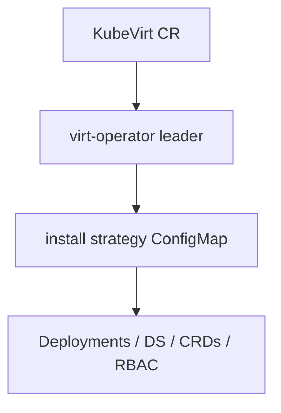
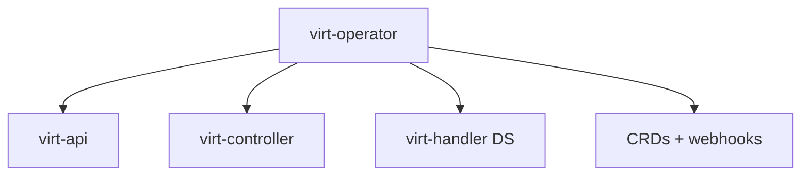
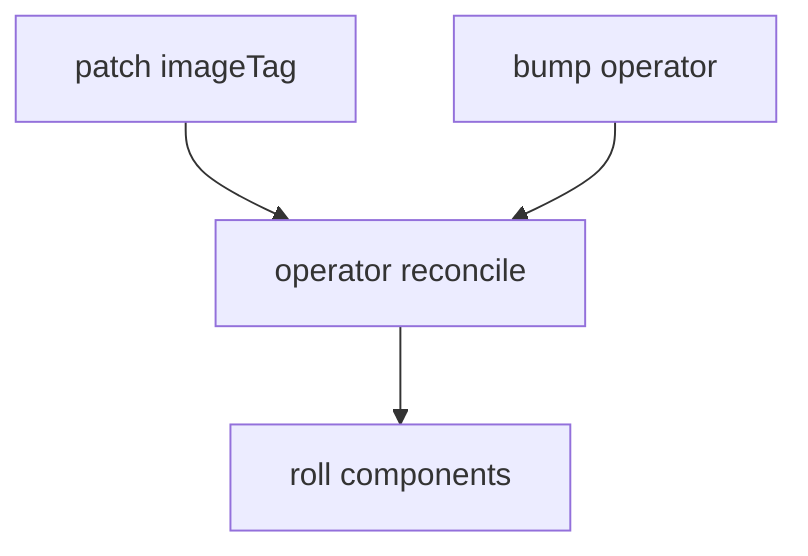
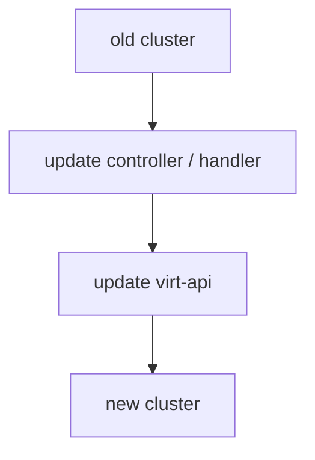
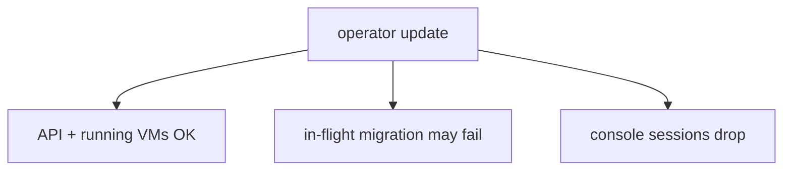
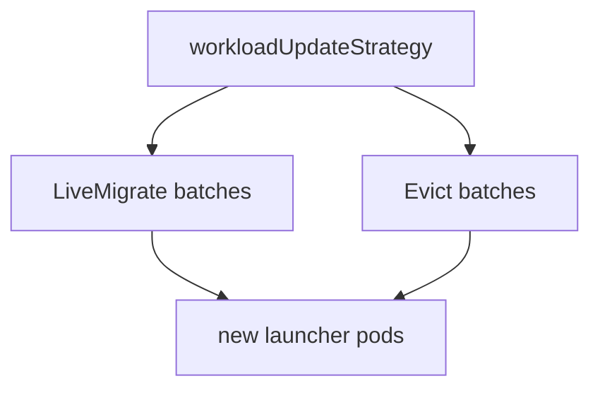

## !intro Operator and updates

**virt-operator** is often the only component you install by hand. It watches the **KubeVirt** CR and converges Deployments, DaemonSets, CRDs, RBAC, webhooks, and certs. Updates are designed for control-plane availability — with a few sharp edges you must remember in PRs.

## !!steps KubeVirt CR is the knob

Create/update a `KubeVirt` object (image tag, registry, configuration, workload update strategy). The operator’s install strategy (ConfigMap) is the desired manifest set; reconciliation patches drift. Leader-elected replicas; only the leader reconciles.



## !!steps What it applies

Roughly: virt-api, virt-controller, virt-handler DaemonSet, CRDs, services, webhooks, certificates, optional ServiceMonitor paths. Cluster detection (OpenShift vs plain Kubernetes) swaps SCC/Route handling. Feature probes adjust to what CRDs exist.



## !!steps Triggering an update

Two common patterns:

1. Patch `spec.imageTag` (and friends) on the KubeVirt CR  
2. Or omit pin fields so the CR tracks the **operator** version — bump the operator, components follow  

Either way the operator rolls the world toward the new strategy.



## !!steps Controllers before virt-api

Update ordering matters: bring controllers/handler to a version that understands new behavior **before** virt-api advertises it. Old API + new controllers is safer than new API + old controllers. RBAC is often **unioned** during skew so neither side loses permissions mid-roll.



## !!steps Zero downtime — with caveats

Control plane stays able to create/delete/modify VMs. Running guests keep running. Known hits during update:

- In-flight **migrations** can fail (handler TLS/stream cut) — guest survives  
- **console/VNC** connections drop when their virt-api pod rolls  

Design features so mixed-version handler/launcher still talk.



## !!steps Workload updater

After components roll, **workload-updater** can move existing launchers onto new images via LiveMigrate or Evict batches (`KubeVirtWorkloadUpdateStrategy`). That is how “guests eventually run new launcher bits” without a big-bang restart. Know LiveMigrate vs Evict tradeoffs when reviewing default strategy changes.



## !!steps PR question: will this survive skew?

Socket paths, Cmd/Notify fields, CRD defaults, and handler expectations must tolerate old launchers briefly. If your change assumes every node updated atomically, it will break real upgrades.

```go ! skew.go
// Teaching sketch — tolerate the partner you did not update yet.
if launcher.Supports(FeatureX) {
	// !focus(1:1)
	return newPath()
}
return legacyPath()
```

## !outro Continue

How VM metrics actually flow — cgroups vs domain stats, and what Prometheus scrapes.
