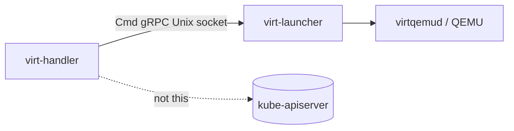
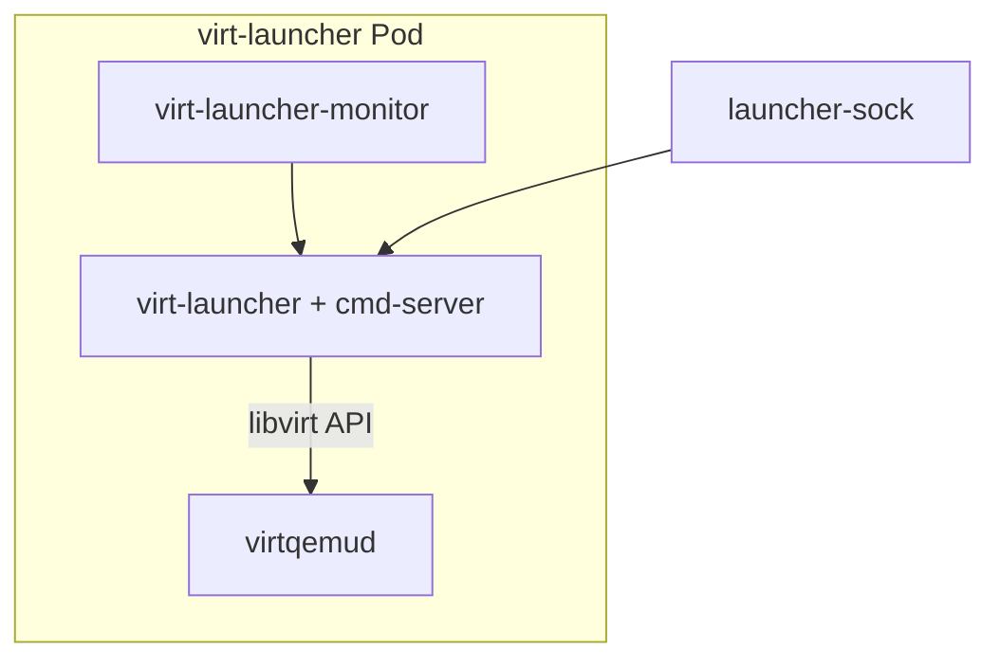
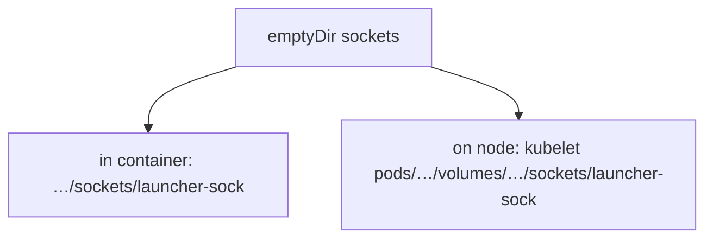
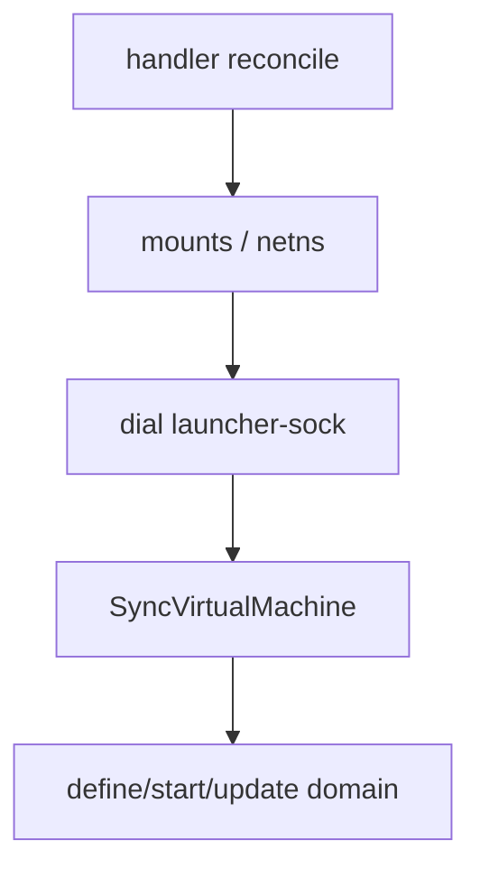
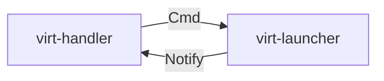
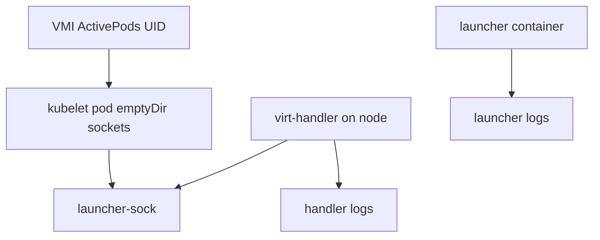

## !intro Tracing the Cmd socket

virt-handler never speaks libvirt. It speaks **Cmd**: a gRPC service over a Unix domain socket into the virt-launcher Pod. This walkthrough follows that socket from the protobuf contract, through process layout on the node, to how you see it when the stack is deployed.

## !!steps Why Cmd exists

The launcher owns QEMU/virtqemud inside the Pod sandbox. The handler is the privileged node agent. Crossing that boundary with Kubernetes API calls for every pause/sync/stats request would be wrong altitude. Cmd is a **local, per-VMI RPC bus**: handler dials in; launcher executes against the domain.



## !!steps The contract: cmd.proto

The surface lives in `pkg/handler-launcher-com/cmd/v1/cmd.proto` as service `Cmd`. Lifecycle (`SyncVirtualMachine`, shutdown/kill), migration, hotplug, guest queries (`GetDevices`, `GetUsers`, …), and stats (`GetDomainStats`) are all RPCs on the same channel. VMI payloads ride as JSON bytes inside protobuf messages — keep libvirt XML and QMP details on the launcher side of the wire.

```go ! proto.go
// Teaching sketch — the Cmd service is the handler→launcher contract.
service Cmd {
	// !focus(1:3)
	rpc SyncVirtualMachine(VMIRequest) returns (Response) {}
	rpc GetDomainStats(EmptyRequest) returns (DomainStatsResponse) {}
	rpc GetDevices(EmptyRequest) returns (GuestDevicesResponse) {}
}
```

## !!steps Launcher runs the server

In the virt-launcher process, `cmdserver.RunServer` listens on a Unix socket and dispatches to a `DomainManager` that talks to virtqemud. PID 1 is usually the monitor; the launcher process hosts this gRPC server. If the socket is down, the handler cannot sync that VMI — other VMs on the node are unaffected.



## !!steps Ready handshake: rename the socket

The server first listens on an **uninitialized** socket name, pings itself, then `rename`s to the final `launcher-sock` (`markReady` in `cmd/virt-launcher`). Handlers and monitors treat the final name as “cmd-server is accepting.” A missing or stuck init name is a common “VMI never leaves Scheduling/Waiting” clue.

```go ! ready.go
// Teaching sketch — ready means the final socket name exists.
func markReady() {
	// !focus(1:1)
	os.Rename(UninitializedSocketOnGuest(), SocketOnGuest())
}
```

## !!steps Where the file lives in the Pod

Inside the launcher, sockets sit under the shared sockets directory (guest helpers use `/var/run/kubevirt/sockets/…`, file name `launcher-sock`). That directory is an **emptyDir** volume on the Pod so the kubelet materializes it under the pod UID on the node — which is how a privileged handler can reach it without entering the container network namespace for dial.



## !!steps How virt-handler finds the socket

`pkg/virt-handler/cmd-client` resolves paths from `vmi.Status.ActivePods`. For each pod UID it checks the kubelet pods base dir:

`…/pods/<pod-uid>/volumes/kubernetes.io~empty-dir/sockets/launcher-sock`

During migration, more than one ActivePod may exist; the local node’s pod directory is the one that resolves. No pod dir → no Cmd client for that VMI on this node.

```go ! find.go
// Teaching sketch — discover the local launcher socket via ActivePods.
for podUID := range vmi.Status.ActivePods {
	// !focus(1:2)
	socket := SocketFilePathOnHost(string(podUID))
	// use first path that exists on this node
}
```

## !!steps Dial and SyncVirtualMachine

The client (`cmd-client`) opens a gRPC connection to that Unix path, serializes the VMI to JSON, wraps a `VMIRequest`, and calls RPCs with short/long timeouts (seconds to tens of seconds depending on the call). `SyncVirtualMachine` is the workhorse after mounts/netns prep: “make the domain match this spec.”



## !!steps Notify is the other direction

Cmd is handler → launcher. Domain lifecycle events flow back on **Notify** (`pkg/handler-launcher-com/notify`) so the handler can update VMI status without polling every change. When debugging “status stuck,” ask whether Cmd sync failed or Notify never delivered.



## !!steps On a deployed node

With a Running VMI you can reason about the live path:

1. Note the launcher Pod UID from the VMI (`status.activePods` / virt-launcher pod).  
2. On the node (or via a debug pod with host mounts), expect `launcher-sock` under that pod’s emptyDir sockets volume.  
3. Handler logs show sync/cmd errors and unresponsive-socket handling (early grace while the launcher starts, then Failed).  
4. Launcher logs show cmd-server / domain manager reactions to each RPC.

You do not normally `grpcurl` this socket in production — the supported clients are virt-handler (and tests). Understanding the path tells you **which log stream** and **which UID directory** to trust.



## !!steps Failure modes worth memorizing

| Symptom | Likely layer |
|---------|----------------|
| Socket missing after several minutes | Launcher never marked ready / crash loop |
| Unresponsive marker file | Monitor gave up on cmd-server |
| Sync timeouts | Launcher stuck in libvirt/QEMU, or node overload |
| Wrong pod UID after migrate | Looking at source pod on target node |
| Proto mismatch after upgrade | Skew: new RPC vs old launcher image |

Keep privileged path work on the handler; keep domain XML/QMP on the launcher; change the `.proto` when both sides must learn a new verb.

```go ! triage.go
// Teaching sketch — classify before patching.
type CmdFailure string
const (
	// !focus(1:3)
	FailNoSocket    CmdFailure = "no launcher-sock on node"
	FailUnresponsive CmdFailure = "socket marked unresponsive"
	FailRPCTimeout  CmdFailure = "gRPC deadline exceeded"
)
```

## !outro Keep going

Related curriculum: Node path (handler/launcher roles), Metrics (GetDomainStats over the same channel), and API/gates/generate (how to extend the proto safely).
