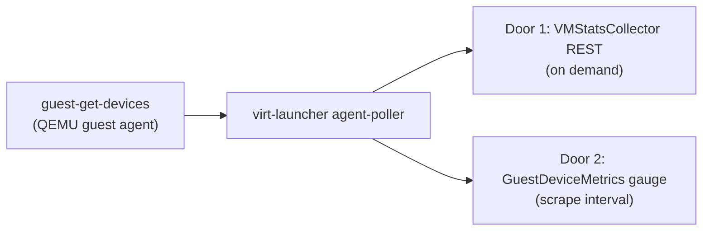
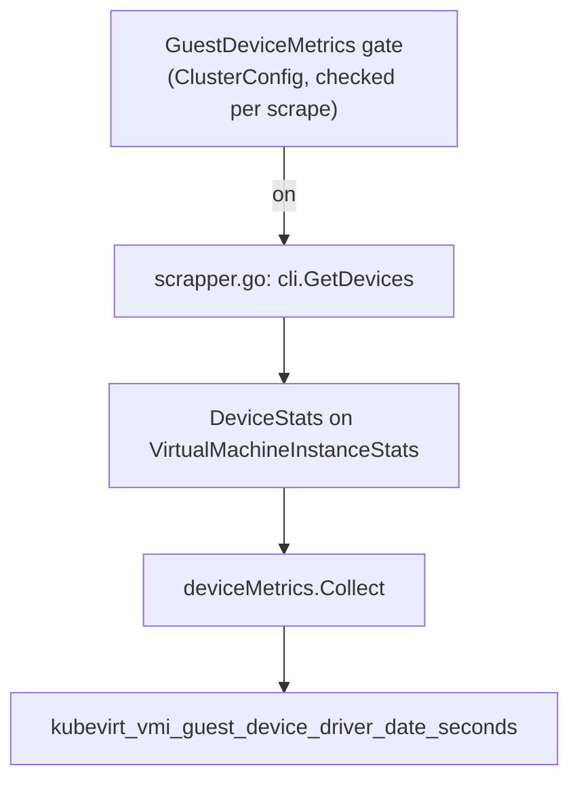
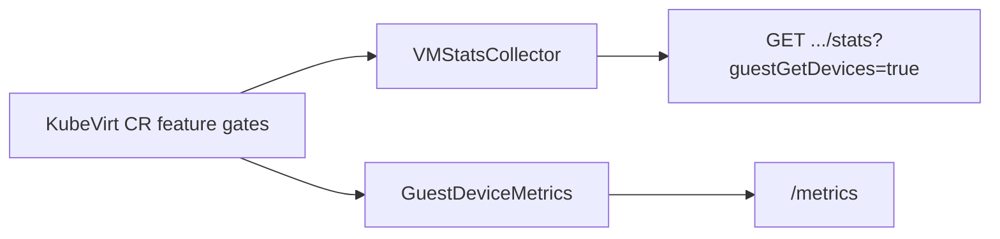

## !intro Wiring guest-get-devices end to end

[shanemcd/kubevirt#1](https://github.com/shanemcd/kubevirt/pull/1) adds one new QEMU guest agent command — `guest-get-devices` — which asks the guest for its device driver info (name, version, install date) over the same in-guest channel used for filesystem lists and OS info. The PR threads that one command through **two independent doors** into KubeVirt. Same guest data, two feature gates, two cadences. This walkthrough follows the wire from proto to cluster.

## !!steps Two doors, one guest command

**Door 1** is `VMStatsCollector`: an existing feature gate that turns on a debug REST endpoint on virt-handler. With it enabled, you can ask virt-handler — right now, over HTTP — for whatever guest stats categories you want for a given VMI (CPU, disks, filesystems, …), and it fetches them on the spot. No storage, no history: just an on-demand snapshot. This PR adds `guestGetDevices` as one more category you can ask that endpoint for.

**Door 2** is new: `GuestDeviceMetrics`, a feature gate that turns on a standing Prometheus gauge. KubeVirt already runs a background loop (the "domainstats scraper") that periodically polls every running VMI and updates metrics you can scrape from `/metrics`. This PR adds a collector to that loop so device driver info shows up there too, continuously, instead of only when someone asks.

Same guest command, two gates, two very different consumers — one is "ask now," the other is "always available."



## !!steps The contract: cmd.proto grows a verb

`pkg/handler-launcher-com/cmd/v1/cmd.proto` gets a standalone RPC (`GetDevices` / `GuestDevicesResponse`) **and** a new field on the existing aggregate stats messages (`AgentDevicesRequest` at 17, `Response guestGetDevices` at 19). Two shapes for the same guest call: direct RPC, or one more field in the `GetVMStats` bundle.

```go ! cmd.proto
// Teaching sketch — cmd.proto grows one RPC and one aggregate field.
service Cmd {
  rpc GetFilesystems(EmptyRequest) returns (GuestFilesystemsResponse) {}
  // !focus(1:1)
  rpc GetDevices(EmptyRequest) returns (GuestDevicesResponse) {}
}

message VMStatsRequest {
  AgentMemoryBlocksRequest guestGetMemoryBlocks = 16;
  AgentDevicesRequest guestGetDevices = 17;
}
```

## !!steps Guest agent parsing

The agent reply is QEMU's own JSON shape (`driver-date`, `driver-name`, `id.device-id`, …). `pkg/virt-launcher/virtwrap/agent-poller/agent_parser.go` unmarshals into a private `deviceJSON`, then converts to the stable `api.Device` type the rest of KubeVirt uses — the usual pattern for keeping QEMU's wire format out of KubeVirt's own API.

```go ! agent_parser.go
func parseDevices(agentReply string) ([]api.Device, error) {
	result := []deviceJSON{}
	// !focus(1:1)
	json.Unmarshal([]byte(stripAgentResponse(agentReply)), &result)

	converted := make([]api.Device, 0, len(result))
	for _, d := range result {
		converted = append(converted, api.Device{
			DriverName: d.DriverName, DriverDate: d.DriverDate,
		})
	}
	return converted, nil
}
```

## !!steps The poller schedules it as static data

`agent_poller.go` adds `GetDevices` as an `AgentCommand` and schedules it on the **version interval**, not the frequent stats interval — driver info barely changes, so there's no reason to poll it every few seconds. The result lands in the launcher's in-memory `AsyncAgentStore`, keyed by command, ready for either door to read.

```go ! agent_poller.go
{
	// Driver info is essentially static; reuse the infrequent version interval.
	// !focus(1:2)
	CallTick:      qemuAgentVersionInterval,
	AgentCommands: []AgentCommand{GetDevices},
},
```

## !!steps cmd-server: one RPC, one table row

Two things happen in the launcher's cmd-server. First, `Launcher.GetDevices` answers the standalone RPC straight from `DomainManager.GetDevices()`. Second, `vmstats.go`'s `agentDataFields` table gets one more row — this is the table that decides, per `VMStatsRequest`, which optional agent calls to make and where to stash the response. `guest-get-devices` also joins the 30-minute TTL bucket alongside `guest-get-memory-blocks`: infrequent, cacheable guest data.

```go ! vmstats.go
var agentDataFields = []agentDataField{
	// !focus(1:1)
	{"guest-get-devices",
		func(r *cmdv1.VMStatsRequest) bool { return r.GuestGetDevices != nil },
		func(r *cmdv1.VMStatsResponse, resp *cmdv1.Response) { r.GuestGetDevices = resp }},
}

var agentDataCommandTTLs = map[string]time.Duration{
	"guest-get-devices": thirtyMinutes,
}
```

## !!steps cmd-client: direct call vs bundled field

`pkg/virt-handler/cmd-client/client.go` gets both shapes. `GetDevices()` dials the standalone RPC and unmarshals `GuestDevicesResponse` into `[]api.Device` for callers that just want device info. `GetVMStats()` — already dialing the aggregate RPC for whatever else was requested — now also copies `GuestGetDevices` out of the bundled response. Same launcher socket, same client, two call shapes depending on what the caller asked for.

```go ! client.go
func (c *VirtLauncherClient) GetVMStats(request *cmdv1.VMStatsRequest) (*stats.VMStats, error) {
	vmstatsResponse, err := c.v1client.GetVMStats(ctx, request)
	// !focus(1:1)
	result.GuestGetDevices = vmstatsResponse.GetGuestGetDevices().GetMessage()
	return result, err
}
```

## !!steps Door 1: the REST endpoint

`pkg/virt-handler/rest/vmstats.go` adds `guestGetDevices=true` as a query parameter next to a dozen siblings, all folded into one `cmdv1.VMStatsRequest`. `VMStatsHandler.GetVMStats` checks the **existing** `VMStatsCollectorEnabled()` gate before doing any work — 403 if it's off. This door was never metric infrastructure; it is a debug/inspection endpoint that happens to reuse the same guest-poll machinery.

```go ! vmstats.go
func (h *VMStatsHandler) GetVMStats(request *restful.Request, response *restful.Response) {
	if !h.clusterConfig.VMStatsCollectorEnabled() {
		// !focus(1:1)
		response.WriteError(http.StatusForbidden, fmt.Errorf("VMStatsCollector feature gate is not enabled"))
		return
	}
	statsRequest := buildVMStatsRequestFromQuery(request) // reads guestGetDevices=true
}
```

## !!steps Door 2: a standing gauge, gated separately

`device_metrics.go` is a new `resourceMetrics` collector registered in `collector.go`, exposing `kubevirt_vmi_guest_device_driver_date_seconds{driver_name,driver_version,device_id}`. It reads `DeviceStats`, a field added to `VirtualMachineInstanceStats`. But `scrapper.go` only populates `DeviceStats` when a **new, separate** gate — `GuestDeviceMetricsEnabled()` — is on. `SetupMetrics` now takes the `ClusterConfig` so the scraper can check that gate on every scrape, not just at startup.



## !!steps On a deployed cluster

Two independent switches, two independent ways to see the data:

1. **REST door** — enable `VMStatsCollector` on the KubeVirt CR, then hit virt-handler's stats endpoint with `?guestGetDevices=true` for a VMI. You get a one-shot JSON blob straight from the guest agent's current poll cache.
2. **Metrics door** — enable `GuestDeviceMetrics` instead (or as well), then scrape `/metrics` and grep for `kubevirt_vmi_guest_device_driver_date_seconds`. It updates on the domainstats scraper's normal cadence, labeled per device.

The PR's own test plan matches this split: a Windows guest returning real VirtIO driver JSON over the launcher cmd socket, and a Linux guest (no matching agent command) hitting `CommandNotFound` — which the poller has to absorb without crashing the rest of the stats collection.



## !outro One command, two consumers

The lesson worth keeping: adding a guest-agent command is never "add one field." It's a proto verb *and* an aggregate-field, a poller schedule decision (how static is this data, really?), and — because this PR feeds both a debug endpoint and a metric — two separate feature-gate decisions about who gets to see it and how often. The second commit's own history has a concrete `generate` gotcha too: rebasing the two paths onto each other collided two message descriptor indexes in `cmd.pb.go`, caught only by regenerating after the rebase. See Contributing → API/gates/generate for that step, and Platform → Metrics for how `GetDomainStats` rides the same cmd-server table.
